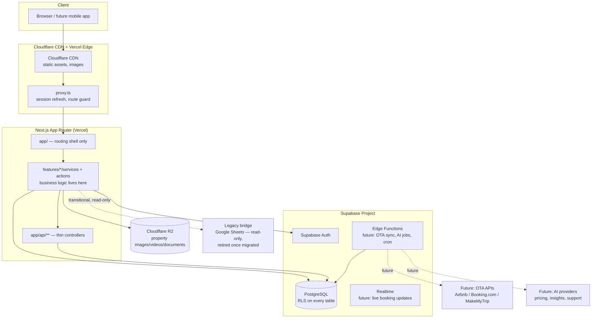

# Everloft Hospitality Asset Management Platform — Architecture Blueprint

**Status**: Official blueprint for all future Everloft development.
**Scope of this document**: architecture and folder structure only. No business logic, no
feature implementations, no pages. Existing code does not yet fully conform to this blueprint —
see §17 ("Current state vs. target state") for the honest gap and the migration plan.

---

## 0. What Everloft actually is

Everloft is an enterprise **Hospitality Asset Management Platform (HAMP)** — comparable in kind
to Guesty, Hostaway, or an internal Airbnb ops console — not a consumer hotel-booking site. It
has two audiences with fundamentally different needs, served by one codebase:

1. **Public marketing site** — thin, mostly static, SEO-driven (home, properties showcase, owner
   program, investor program, about, contact).
2. **The platform** — an internal-and-partner-facing system of record for properties, owners,
   investors, bookings, revenue, expenses, housekeeping, maintenance, documents, reports,
   analytics, and eventually OTA sync and AI insights, used by 8 distinct roles today
   (Super Admin, Operations, Finance, Property Owner, Investor, Housekeeping, Maintenance,
   Guest) with room for more.

Everything in this document is organized around that second, harder problem: how do you keep a
system with 20+ business domains, thousands of properties, and millions of records
**understandable by one engineer looking at one folder**, five years in.

---

## 1. High-level architecture



**Why this shape**:
- **UI never talks to Supabase or R2 directly.** Every read/write goes through a feature's
  `services/` layer. This is the single most important rule in this document — see §8–9.
- **Supabase is both the database and the auth provider**, so RLS (not application code) is the
  real authorization boundary. The app enforces permissions for *UX* (hiding buttons, gating
  routes); Postgres enforces them for *security*. Losing sight of this distinction is how
  enterprise platforms end up with data leaks — see §15.
- **Edge Functions are where OTA sync, AI jobs, and scheduled reports eventually live** — not in
  Next.js API routes, because those need to run independent of a request (cron, webhooks from
  Airbnb/Booking.com, long-running AI inference) and scale independently of the web app.
- **The legacy Google Sheets bridge is explicitly transitional.** It is real, live data
  (see `web/CLAUDE.md`), but it is not part of the target architecture — new feature modules
  read from Postgres, never from Sheets. It gets retired once historical data is migrated.

---

## 2. Complete folder structure (target)

```
web/
├── src/
│   ├── app/                              # ROUTING ONLY — no business logic lives here
│   │   ├── (site)/                       # public marketing route group
│   │   │   ├── layout.tsx                # Public Layout
│   │   │   ├── page.tsx
│   │   │   ├── properties/
│   │   │   ├── property-management/
│   │   │   ├── investor-program/
│   │   │   ├── about/ contact/ faq/ ...
│   │   ├── (auth)/                       # Authentication Layout route group
│   │   │   ├── layout.tsx
│   │   │   ├── login/
│   │   │   ├── forgot-password/
│   │   │   └── reset-password/
│   │   ├── dashboard/                    # Dashboard Layout — the platform itself
│   │   │   ├── layout.tsx                # role-aware shell (sidebar/nav driven by config/navigation.ts)
│   │   │   ├── page.tsx                  # role-routed home/overview
│   │   │   ├── properties/               # thin route files — import from features/properties
│   │   │   │   ├── page.tsx              # list
│   │   │   │   ├── [propertyId]/page.tsx # detail
│   │   │   │   └── new/page.tsx
│   │   │   ├── bookings/
│   │   │   ├── owners/
│   │   │   ├── investors/
│   │   │   ├── revenue/
│   │   │   ├── expenses/
│   │   │   ├── housekeeping/
│   │   │   ├── maintenance/
│   │   │   ├── documents/
│   │   │   ├── reports/
│   │   │   ├── notifications/
│   │   │   ├── calendar/
│   │   │   ├── support/
│   │   │   ├── users/
│   │   │   ├── roles/
│   │   │   ├── settings/
│   │   │   └── [role]/                   # existing per-role workspace (kept — see §17)
│   │   ├── api/                          # Route Handlers = thin controllers only
│   │   │   ├── auth/
│   │   │   ├── properties/
│   │   │   ├── bookings/
│   │   │   ├── revenue/
│   │   │   ├── expenses/
│   │   │   ├── users/
│   │   │   ├── notifications/
│   │   │   ├── reports/
│   │   │   ├── webhooks/                 # future: OTA/payment provider webhooks
│   │   │   └── files/
│   │   └── auth/callback/
│   │
│   ├── features/                         # THE HEART OF THE ARCHITECTURE — one folder per business domain
│   │   ├── auth/
│   │   ├── properties/
│   │   │   ├── components/               # PropertyCard, PropertyForm, PropertyTable, PropertyFilters
│   │   │   ├── hooks/                    # useProperty, useProperties, usePropertyMutations
│   │   │   ├── services/                 # properties.service.ts — the ONLY place querying Supabase for this domain
│   │   │   ├── actions/                  # Server Actions for mutations invoked from forms
│   │   │   ├── api/                      # fetch wrappers consumed by hooks (client-side callers of app/api/**)
│   │   │   ├── types/                    # Property, PropertyStatus, PropertyType
│   │   │   ├── schemas/                  # Zod: createPropertySchema, updatePropertySchema
│   │   │   ├── store/                    # feature-local client state (rare — e.g. multi-step wizard state)
│   │   │   ├── constants/                # PROPERTY_TYPES, PROPERTY_STATUSES
│   │   │   ├── utils/                    # domain-specific pure functions
│   │   │   └── index.ts                  # public barrel — the ONLY import path other features may use
│   │   ├── bookings/                     # (same internal shape as properties/)
│   │   ├── owners/
│   │   ├── investors/
│   │   ├── revenue/
│   │   ├── expenses/
│   │   ├── housekeeping/
│   │   ├── maintenance/
│   │   ├── documents/
│   │   ├── notifications/
│   │   ├── reports/
│   │   ├── analytics/
│   │   ├── calendar/
│   │   ├── support/
│   │   ├── crm/
│   │   ├── payments/
│   │   ├── ai/
│   │   ├── users/
│   │   ├── roles/
│   │   ├── permissions/
│   │   └── settings/
│   │
│   ├── components/                       # SHARED, feature-agnostic UI only
│   │   ├── ui/                           # shadcn primitives — unopinionated, no business meaning
│   │   ├── shared/                       # app-opinionated composites — DataTable, EmptyState, ErrorState,
│   │   │                                 #   ConfirmDialog, FileUpload, ImageViewer, MapView, DatePickerField
│   │   ├── layouts/                      # DashboardShell, Sidebar, Topbar, Breadcrumbs
│   │   └── motion/                       # Reveal/RevealGroup wrappers (already exists)
│   │
│   ├── lib/                              # Cross-cutting TECHNICAL infrastructure — never business logic
│   │   ├── supabase/                     # client.ts, server.ts, admin.ts, middleware.ts, types.ts (exists)
│   │   ├── storage/                      # r2.ts (exists)
│   │   ├── rbac/                         # permissions.ts (exists), guards.ts
│   │   ├── query/                        # TanStack Query client + QueryProvider, query key factory
│   │   ├── errors/                       # AppError classes, error-to-toast mapper, API error parser
│   │   ├── logger/                       # structured logger (server-side), never console.log in features/
│   │   └── utils/                        # generic helpers (date, currency, string) — no domain knowledge
│   │
│   ├── config/                           # Static configuration, not secrets
│   │   ├── env.ts                        # validated, typed process.env access (fail fast on missing var)
│   │   ├── site.ts                       # site metadata, company info
│   │   ├── navigation.ts                 # sidebar/nav structure per role — data, not JSX
│   │   ├── permissions.ts                # PermissionKey union + role→permission defaults (mirrors DB seed)
│   │   └── theme.ts                      # design tokens referenced outside CSS (e.g. chart colors)
│   │
│   ├── hooks/                            # TRULY global hooks only (useMediaQuery, useDebounce, useIsMounted)
│   │                                     #   a hook that only makes sense for one domain belongs in
│   │                                     #   features/<domain>/hooks/, not here.
│   ├── types/                            # Cross-feature shared types + generated Supabase Database type
│   ├── providers/                        # QueryProvider, ThemeProvider, ToastProvider — composed in app/layout.tsx
│   ├── styles/                           # globals.css (Tailwind v4 @theme tokens)
│   ├── constants/                        # truly global constants (app name, external URLs)
│   ├── emails/                           # future: transactional email templates (React Email)
│   └── proxy.ts                          # Next 16 middleware — session refresh + route protection (exists)
│
├── supabase/
│   ├── migrations/                       # exists — schema is source of truth, applied via `supabase db push`
│   ├── functions/                        # future: Edge Functions (OTA sync, scheduled reports, AI jobs)
│   └── config.toml                       # exists
│
├── public/
├── scripts/                              # one-off ops scripts (seeding, migrations helpers) — never imported by app code
├── tests/                                # future — see §17
└── docs/
    └── ARCHITECTURE.md                   # this file
```

---

## 3. What every top-level folder is *for* (and the one rule that keeps it clean)

| Folder | Purpose | The rule that must never be broken |
|---|---|---|
| `app/` | Routing, layouts, route-level data fetching glue | Contains **no** Supabase calls, no business logic — a page component's job is to call a feature's service/hook and render a feature component. If a `page.tsx` is more than ~40 lines, logic has leaked in from `features/`. |
| `features/` | All business logic, one folder per domain | A feature may import from `lib/`, `components/`, `config/`, `types/` — **never** reach into another feature's internals. Cross-feature use goes through that feature's `index.ts` barrel only. |
| `components/` | Presentation only | Zero Supabase imports, zero `features/*` imports. If a shared component needs domain data, it receives it via props — it does not fetch it. |
| `lib/` | Technical plumbing | No business rules. `lib/supabase/` knows *how* to talk to Postgres; it does not know what a "booking" is. |
| `config/` | Static, non-secret configuration | Data, not logic. `navigation.ts` is an array of `{label, href, icon, permission}` objects — the Sidebar component just renders it. |
| `types/` | Types shared across ≥2 features | A type used by only one feature belongs in that feature's `types/`, not here. |
| `providers/` | React context composition | Thin wrappers only — the actual client setup (e.g. QueryClient config) lives in `lib/query/`. |

This table is the answer to "where does X go?" for 90% of future PRs. When something doesn't
obviously fit, it almost always means it's trying to be business logic (→ `features/`) disguised
as infrastructure (`lib/`).

---

## 4. Feature module architecture

Every entry under `features/` has an identical internal shape, so once an engineer has learned
`features/properties/`, they already know `features/bookings/`:

```
features/properties/
├── components/     # dumb-ish, but property-aware: PropertyCard, PropertyStatusBadge, PropertyForm
├── hooks/          # useProperties(), useProperty(id), useCreateProperty() — wrap TanStack Query
├── services/       # properties.service.ts — every Supabase query/mutation for this domain, typed in/out
├── actions/        # Server Actions — createPropertyAction(), used by forms via useFormState/RHF
├── api/            # thin `fetch` clients, only needed for client components calling app/api/** directly
├── types/          # Property, PropertyInsert, PropertyStatus (enum), PropertyWithOwner (joined view)
├── schemas/        # Zod: propertyCreateSchema, propertyUpdateSchema — shared by the form AND the server action
├── store/          # only if the feature needs client state beyond server-state + form-state (rare)
├── constants/       # PROPERTY_TYPE_LABELS, PROPERTY_STATUS_COLORS
├── utils/          # formatPropertyAddress(), isPropertyActive() — pure, no I/O
└── index.ts        # export { PropertyCard, useProperties, propertyCreateSchema, type Property }
```

**Data flow inside a feature** (this is the pattern every module follows):

```
Form (React Hook Form + zodResolver(schema))
  → Server Action (actions/) — validates again server-side, never trusts the client
    → Service (services/) — the only code that imports @/lib/supabase
      → Supabase (RLS enforces the real permission check)
  ← revalidatePath / TanStack Query invalidation
  ← UI updates
```

**Why Server Actions *and* a services layer, not one or the other**: Server Actions are the
Next.js-idiomatic way to mutate data from a form without hand-rolling a fetch + API route. The
services layer underneath them is what makes that logic *also* callable from a Route Handler
(for external integrations/webhooks), a cron Edge Function, or a test — without duplicating the
Supabase query. Server Actions are a thin caller of the service, never a place where a Supabase
query is written inline.

---

## 5. Shared component architecture

Three tiers, increasing in app-specific opinion:

1. **`components/ui/`** — shadcn primitives (`button.tsx`, `dialog.tsx`, `table.tsx`, ... — already
   14 installed). Pure, unopinionated, no knowledge that Everloft exists. Never edit these by hand
   beyond the documented custom variants (`gold`/`gold-outline`/`blue-accent` — see `web/CLAUDE.md`);
   regenerate via `npx shadcn add`.
2. **`components/shared/`** — composed from `ui/` primitives into patterns every feature needs:
   `DataTable` (wraps TanStack Table + `ui/table.tsx` with sorting/pagination/column-visibility
   built in once), `EmptyState`, `ErrorState`, `ConfirmDialog`, `FileUploadZone` (wired to
   `lib/storage`), `ImageViewer`, `MapView`, `DatePickerField` (wraps `ui/calendar.tsx` for
   RHF), `StatCard`, `PageHeader` (title + breadcrumbs + action button slot). Built **once**, used
   by every feature — this is what prevents 20 features from each reinventing pagination.
3. **`components/layouts/`** — `DashboardShell` (sidebar + topbar + content slot), `Sidebar`
   (renders `config/navigation.ts`, filtered by the current user's permissions), `Topbar`
   (search, notifications bell, user menu), `Breadcrumbs`.

**Rule**: a component graduates from living inside a feature's `components/` to
`components/shared/` the moment a *second* feature needs it. Don't pre-emptively generalize
before that happens — premature abstraction is exactly as costly as duplication here.

---

## 6. Layout architecture

Rather than seven fully separate layout trees (Public/Dashboard/Owner/Investor/Guest/Admin/Auth),
which would mean seven copies of the same shell to keep in sync, Everloft uses **three physical
layouts, parameterized by role/permission**:

| Layout | Route group | Who sees it | How it varies per role |
|---|---|---|---|
| **Public Layout** | `(site)` | Everyone, logged out | Navbar/Footer only — no variation needed. |
| **Authentication Layout** | `(auth)` | Logged-out users on `/login` etc. | None — single centered-card layout. |
| **Dashboard Layout** | `dashboard/` | Every authenticated role (Super Admin through Guest) | **One** `DashboardShell` component. `Sidebar` renders a *different set of nav items* per role by filtering `config/navigation.ts` against the session's `permissions[]` (already available from `getDashboardSession()`). "Owner Layout" and "Investor Layout" are not separate component trees — they are the same shell with a different filtered nav and a different landing page (already implemented: `/dashboard/{role-slug}`). |

**Why one parameterized shell instead of six**: the existing, already-built dashboard system
(`generic-dashboard.tsx` + `role-profiles.ts` + `workspaces.ts`) already proves this pattern works
well for Everloft's 11 real roles — permission-gated *sections* within one shell, not
role-specific shells. This blueprint formalizes that as the standing pattern for every future
module, rather than introducing a second, conflicting layout strategy.

---

## 7. Routing architecture

```
/                                    Public — home
/properties  /about  /contact  ...   Public — marketing (site)
/login  /forgot-password  /reset-password        (auth)

/dashboard                           Role-routed home (redirects to /dashboard/{role-slug}
                                      for most roles; Super Admin/Tech Admin see the platform
                                      overview directly — already implemented)
/dashboard/{role-slug}               Existing personalized per-role workspace (kept, see §17)

/dashboard/properties                Properties module (new)
/dashboard/properties/[propertyId]
/dashboard/properties/new
/dashboard/bookings
/dashboard/bookings/[bookingId]
/dashboard/owners
/dashboard/owners/[ownerId]
/dashboard/investors
/dashboard/investors/[investorId]
/dashboard/revenue
/dashboard/expenses
/dashboard/housekeeping
/dashboard/maintenance
/dashboard/documents
/dashboard/reports
/dashboard/notifications
/dashboard/calendar
/dashboard/support
/dashboard/users
/dashboard/roles
/dashboard/settings
```

**Reconciling `/dashboard/{role-slug}` with `/dashboard/properties` etc.**: these are not
competing patterns. `/dashboard/{role-slug}` is a role's **personalized home** — "what does my
day look like." `/dashboard/properties`, `/dashboard/bookings`, etc. are **entity management
modules** — full CRUD screens for a business object, reachable by anyone holding the relevant
permission (`manage_properties`, `manage_bookings`, ...) regardless of role, and linked from the
sidebar. A Property Manager's home page shows *their* assigned properties' status at a glance;
the Properties module is where they go to actually edit one.

**Nested routing conventions**:
- `[id]/page.tsx` = detail/edit view.
- `[id]/@modal/(.)quick-view/page.tsx` — **future**: intercepting route for a quick-view slide-over
  without leaving the list (e.g. clicking a booking row opens a panel, not a full navigation).
  Not built yet; flagged here so it's not "discovered" ad hoc later.
- Route Handlers under `app/api/webhooks/` are the landing point for future OTA/payment provider
  webhooks — kept separate from `app/api/{domain}/` so external-facing endpoints are easy to
  audit as a group.

---

## 8. API architecture

**The rule that matters most in this entire document**: **UI components never call Supabase
directly.** Every domain has exactly one place that imports `@/lib/supabase/*` for that domain —
its `features/<domain>/services/<domain>.service.ts`.

```
app/api/properties/route.ts        (thin controller)
  → features/properties/services/properties.service.ts   (all Supabase calls, typed)
    → lib/supabase/server.ts                              (the only Supabase client construction)
```

A Route Handler's job is: parse/validate the request (Zod), call the service, map the result/
error to an HTTP response. It must not contain a `.from(...)` Supabase call itself. This is what
makes it possible to, for example, swap Postgres query patterns, add caching, or add an audit
hook for one domain without touching 20 route files.

**Route Handlers vs. Server Actions** — both call the same services layer, chosen by *caller*:
- **Server Action**: the mutation is triggered by a form/button inside this Next.js app itself.
- **Route Handler**: the caller is external (a webhook, a mobile app, a script) or the operation
  needs to return something other than a redirect/revalidate (e.g. a signed file URL, a paginated
  JSON response for a client-side data table using TanStack Query).

---

## 9. Service architecture

```ts
// features/properties/services/properties.service.ts
export async function listProperties(filters: PropertyFilters): Promise<Property[]> { ... }
export async function getProperty(id: string): Promise<Property | null> { ... }
export async function createProperty(input: PropertyInsert): Promise<Property> { ... }
export async function updateProperty(id: string, input: PropertyUpdate): Promise<Property> { ... }
```

Rules for every service function:
1. **Typed in, typed out** — parameters and return types come from `features/<domain>/types/`,
   never raw Supabase row types leaking into components.
2. **Throws a typed `AppError`** (from `lib/errors/`) on failure — never lets a raw Postgres/
   PostgREST error reach a component. The centralized error handler (§ below) knows how to turn
   an `AppError` into a toast; it does not know how to interpret a raw `PGRST...` code.
3. **No pagination logic duplicated per feature** — a shared `lib/query/paginate.ts` helper
   wraps `.range()`/count queries consistently, so every feature's list view behaves identically
   at 10,000+ rows (see §14).
4. **RLS is still the real boundary.** A service function using the *user's own* session
   (`lib/supabase/server.ts`) is automatically scoped by RLS — it cannot return rows the user
   isn't allowed to see even if the service code has a bug. Only code with an explicit, reviewed
   reason imports `lib/supabase/admin.ts` (the service-role client that bypasses RLS).

---

## 10. Configuration architecture

| File | Contains | Why it's separated out |
|---|---|---|
| `config/env.ts` | A single validated, typed accessor for every `process.env` var (fails fast at boot if a required one is missing) | Stops "undefined" env var bugs from surfacing as a confusing Supabase/R2 error three layers deep — they fail loudly, at startup, with a clear message. |
| `config/site.ts` | Company name, tagline, contact info, social links | So marketing-site copy isn't hardcoded across 5 page files (already partially true today — see `web/CLAUDE.md`'s "Real business facts"). |
| `config/navigation.ts` | Sidebar/nav structure as data: `{ label, href, icon, permission }[]` | The Sidebar component is dumb and reusable; adding a nav item is a one-line data change, not a JSX edit. |
| `config/permissions.ts` | The `PermissionKey` union (already exists at `lib/rbac/permissions.ts` — moves here under this blueprint) and any UI-facing permission→label mapping | Keeps the "what permissions exist" list in one place that mirrors the DB seed migration, so they can't silently drift apart. |
| `config/theme.ts` | Non-CSS design tokens needed in JS (chart series colors, map pin colors) | Tailwind's `@theme` in `globals.css` covers CSS; anything a chart library or canvas needs as a JS value lives here, referencing the same palette. |

None of these files contain secrets — actual credentials stay in `.env` (gitignored) and are only
read through `config/env.ts`.

---

## 11. State management strategy

Four kinds of state exist in this app. Mixing them is the single most common source of bugs in
dashboards this complex, so each has exactly one designated tool:

| State type | Tool | Example | Never do this |
|---|---|---|---|
| **Server state** (data that lives in Postgres) | **TanStack Query** | List of properties, a booking's detail | Don't copy server data into `useState` and manually re-fetch — Query owns caching/refetching/invalidation. |
| **Global client state** (UI-only, cross-component) | **Zustand** *(recommended addition — not yet installed)* | Sidebar collapsed/expanded, active filters panel open | Don't reach for Redux/Context-as-a-store for this — it's UI state, not domain data, and Zustand's ~1KB footprint with no boilerplate fits a dashboard of this size better than Redux Toolkit. |
| **Local component state** | `useState`/`useReducer` | A dropdown's open state, a hovered row | Don't lift this to global state "just in case." |
| **Form state** | **React Hook Form** (+ Zod via `zodResolver`) | Every create/edit form | Don't track form fields in `useState` — RHF already handles validation, dirty-tracking, and submission state, and every feature's `schemas/` already supplies the Zod schema it needs. |

**Why this specific split matters at Everloft's target scale**: server state at "10,000+
properties, millions of bookings" cannot be naively fetched into component state — TanStack
Query's cache, background refetch, and pagination-aware query keys are what keep the UI fast
without every engineer re-solving caching per feature.

---

## 12. Naming conventions

| Thing | Convention | Example |
|---|---|---|
| Folders | `kebab-case` | `features/property-owners/` (only if a domain name is multi-word; prefer single words where possible: `owners/`) |
| Component files | `kebab-case.tsx`, component itself `PascalCase` | `property-card.tsx` exports `PropertyCard` |
| Hooks | `use-kebab-case.ts`, hook itself `camelCase` prefixed `use` | `use-properties.ts` exports `useProperties` |
| Services | `<domain>.service.ts` | `properties.service.ts` |
| Server Actions | `<verb>-<noun>.action.ts` or grouped in `actions/index.ts` | `create-property.action.ts` |
| Types/Interfaces | `PascalCase`, no `I` prefix | `Property`, `PropertyFilters` (not `IProperty`) |
| Enums | `PascalCase` name, `SCREAMING_SNAKE_CASE` or matching-DB-value members | `PropertyStatus.ONBOARDING` (value matches the DB check constraint's `'onboarding'` via a mapping, not by casing it differently in two places) |
| DTOs | `<Entity>Insert` / `<Entity>Update` (mirrors Supabase generated type convention already used in `lib/supabase/types.ts`) | `PropertyInsert`, `PropertyUpdate` |
| Zod schemas | `<verb><Entity>Schema` | `createPropertySchema`, `updatePropertySchema` |
| Database tables | `snake_case`, plural | `properties`, `role_permissions` (already the convention in `supabase/migrations/`) |
| Database columns | `snake_case` | `owner_id`, `created_at` |
| Constants | `SCREAMING_SNAKE_CASE` | `PROPERTY_TYPE_LABELS` |
| Functions | `camelCase`, verb-first | `getProperty`, `formatCurrency` |

---

## 13. Coding standards

- **TypeScript strict mode**, no `any` — use `unknown` + narrowing at boundaries (API responses,
  form data) instead.
- **Server Components by default.** A file only becomes a Client Component (`"use client"`) when
  it needs interactivity/hooks/browser APIs — matches the pattern already used throughout the
  codebase (e.g. `navbar.tsx`, `login/page.tsx` are client; most `page.tsx` files are server).
- **One component per file**, file name matches the default export.
- **Absolute imports only** (`@/features/...`, `@/lib/...`) — no `../../../` chains.
- **Barrel exports (`index.ts`) per feature**, and *only* the barrel is a valid cross-feature
  import path. ESLint's `no-restricted-imports` should eventually enforce this (see §17, future
  addition).
- **Zod schema colocated with each API boundary** — the same schema validates the form
  client-side and the Server Action/Route Handler server-side; never validate twice with two
  different schemas that can drift.
- **No inline Supabase queries outside `services/`** — this is the rule most worth lint-enforcing
  once the codebase grows (custom ESLint rule flagging `.from(` calls outside `lib/supabase` and
  `features/*/services`).

---

## 14. Scalability considerations

Target: 10,000+ properties, 100,000+ users, millions of bookings, multi-country/currency,
multiple companies/brands (white-label), future mobile apps.

- **Cursor/keyset pagination, not offset**, for any list expected to grow past a few thousand
  rows (bookings, activity_logs already indexed by `created_at desc` in the existing migrations —
  keyset pagination on that column is cheap; `OFFSET 50000` is not).
- **Every foreign key and every RLS-filtered column already has a partial index** in the existing
  migrations (`where deleted_at is null`) — this pattern must continue for every new table so
  soft-deleted rows don't bloat every index scan as the platform grows.
- **RLS performance**: the `authorize()`/`has_role()` helpers are `security definer` + `stable`
  SQL functions specifically so Postgres can cache/inline them per statement — new RLS policies
  should reuse these helpers rather than writing bespoke joins per table, both for consistency and
  for query-planner performance.
- **Multi-tenancy / white-label readiness**: not built yet, but the schema shape anticipates it —
  adding a `company_id`/`brand_id` column to `properties` (and cascading it into RLS policies via
  a `current_company_id()` helper alongside `authorize()`) is a additive migration, not a
  restructuring, *if* every future table is designed with that column from day one even while
  Everloft is single-tenant. This is the one place this blueprint asks future features to pay a
  small upfront cost for a scalability property that's expensive to retrofit.
- **Background/scheduled work** (nightly revenue rollups, OTA sync, report generation) belongs in
  **Supabase Edge Functions on a cron schedule**, not in a Next.js Route Handler — Vercel
  serverless functions have execution time limits unsuited to batch jobs over millions of rows.
- **Cloudflare CDN + R2** already means property images/videos are served from the edge, not
  through the Next.js server — this scales storage-heavy media independently of app compute.
- **TanStack Table** for any admin list is used in **server-side pagination/filtering/sorting
  mode**, never "load everything and paginate client-side" — non-negotiable past a few hundred
  rows per table, which every properties/bookings/revenue list will exceed quickly.

---

## 15. Security considerations

- **RLS is the real authorization boundary**, already true today (every table in
  `supabase/migrations/` has RLS enabled). Application-level `hasPermission()` checks
  (`lib/rbac/permissions.ts`) exist for UX (don't render a button the user can't use) — they are
  a courtesy, not a guarantee, and every new feature must assume a determined user can call the
  API directly and rely on RLS alone to stop unauthorized reads/writes.
- **`lib/supabase/admin.ts` (service-role client) usage must be rare and reviewed** — it bypasses
  RLS entirely. It already carries a `server-only` import guard; every new call site should have
  a one-line comment explaining *why* RLS can't be used instead (e.g. "provisioning a new user
  before they have a session to authenticate with").
- **Every external input is validated with Zod at the boundary** — Route Handler/Server Action —
  never trust a client-computed total, price, or permission flag (the existing booking-price
  calculation already does this correctly server-side; every future mutation follows the same
  rule).
- **Secrets never committed** — `.env` is gitignored, `.env.example` documents shape without real
  values (already the pattern in this repo).
- **Signed URLs for private storage**, public URLs only for genuinely public buckets
  (`property-images` for marketing use) — already implemented in `lib/storage/r2.ts`.
- **Audit trail is automatic, not opt-in** — the generic `record_audit_log()` trigger means a new
  table gets full before/after diff history by adding one `create trigger` line, so "we forgot to
  log this" isn't a failure mode a feature developer can introduce.
- **Rate limiting** (not yet implemented) — flagged as a pre-launch requirement on
  `app/api/auth/*` and any public-facing form endpoint (contact, lead forms) once traffic is real,
  via Vercel's edge middleware or a service like Upstash.

---

## 16. Best practices (summary of rules stated above, as a checklist)

- [ ] UI never imports `@/lib/supabase/*` directly — only `features/*/services` do.
- [ ] A feature never imports another feature's internals — only its `index.ts` barrel.
- [ ] `lib/` never imports from `features/` (one-way dependency: features → lib, never reverse).
- [ ] Every list expected to exceed a few hundred rows uses server-side pagination.
- [ ] Every mutation validates with the same Zod schema on client and server.
- [ ] Every new table: RLS on, standard audit columns, partial indexes on `deleted_at is null`.
- [ ] No component both fetches data *and* renders a large presentational tree — split
      container/presentational once a component exceeds ~150 lines.
- [ ] Server Components by default; `"use client"` is a deliberate, justified choice.

---

## 17. Current state vs. target state — the honest gap, and how it closes

This blueprint describes the **target** architecture. The codebase today does not fully match it,
and pretending otherwise would make this document actively misleading. Concretely:

- **Already built, already fits**: `lib/supabase/` (client/server/admin/middleware/types),
  `lib/storage/r2.ts`, `lib/rbac/permissions.ts`, `proxy.ts`, the full RBAC/RLS Postgres schema in
  `supabase/migrations/`, and the `properties` foundation table. These slot into this blueprint
  exactly where §2 shows them.
- **Already built, different layout than this blueprint**: the existing 11-role analytics
  dashboard (`components/dashboard/*`, `lib/dashboard/*`) predates this blueprint and uses a
  component-type layout, not `features/`. It is real, working, verified, ported-from-production
  code — **not** being retroactively forced into `features/` in a big-bang rewrite. It is
  reorganized into `features/dashboard/` incrementally, the next time it's meaningfully touched,
  following the shape in §4. Forcing an immediate mass-move risks breaking a verified system for
  no user-facing benefit — see `web/CLAUDE.md`'s "Folder structure direction" note, which this
  document supersedes with a concrete plan rather than an open-ended deferral.
- **Not built at all yet**: every `features/<domain>/` folder in §2 for bookings, revenue,
  expenses, documents, reports, analytics, calendar, support, CRM, payments, AI. This document is
  their blueprint before the first line of each is written — that's the point of doing this pass
  before building them.
- **Dependencies referenced in this document but not yet installed**: TanStack Query, TanStack
  Table, Zustand. React Hook Form, Zod, Framer Motion, and Lucide are already installed and in
  active use. Installing the missing three is a `npm install` when the first feature that needs
  them is actually built — not done in this pass, per this task's explicit scope ("design
  architecture, don't build features").

**Migration rule going forward**: any *new* domain (bookings, revenue, etc.) is built directly in
`features/<domain>/` per this blueprint from day one. Existing code migrates opportunistically,
never as a dedicated "refactor everything" project.

---

## 18. Recommended future folder additions

- `tests/` (unit — Vitest) and `e2e/` (Playwright — already installed and used for visual QA
  scripts; formalizing it as a real E2E suite is a natural next step) once the first feature
  module ships.
- `supabase/functions/` — Edge Functions for OTA sync, scheduled revenue rollups, AI inference
  jobs. Not needed until the first of those integrations is actually built.
- `emails/` — React Email templates, once transactional email (booking confirmations, password
  reset copy beyond Supabase's default template) is customized.
- `packages/` — only if Everloft ever splits into a monorepo (e.g. a future mobile app sharing
  `types/`, `schemas/`, and API contracts with `web/`). Not needed at current scope; flagged so a
  future monorepo migration has a clear target shape instead of being invented from scratch.

---

## 19. Developer workflow

1. Pull latest `main`, `npm install`.
2. `npx supabase link --project-ref <ref>` once per machine (already done for the current
   project); `npx supabase db push` after pulling new migrations.
3. Copy `.env.example` → `.env`, fill in real Supabase/R2 values (see `README.md`).
4. `npm run dev`.
5. Building a new feature: create `features/<domain>/` following §4's shape, add thin route
   files under `app/dashboard/<domain>/` that import from it, add its nav entry to
   `config/navigation.ts`, add its permission key to `config/permissions.ts` **and** the matching
   `supabase/migrations/` seed row (both must agree — this is exactly the "two permission
   vocabularies" trap already documented in `web/CLAUDE.md`, don't reintroduce it for the new
   config file).
6. Open a PR — Vercel generates a preview deployment automatically (see §20).

---

## 20. Git branch strategy & deployment workflow

**Branch strategy — trunk-based, not GitFlow**: `main` is always deployable. Short-lived feature
branches (`feature/properties-crud`, `fix/booking-price-rounding`) branch from `main`, get a
Vercel preview deployment per push, and merge back via PR + squash once reviewed. No long-lived
`develop` branch — Vercel's per-PR preview URLs already give every branch its own testable
environment, so a `develop` branch would just be a second, redundant integration point to keep in
sync. Conventional commit messages (`feat:`, `fix:`, `chore:`) for changelog-friendliness, though
not currently enforced by tooling.

**Deployment workflow**:
- **Every PR** → Vercel preview deployment, using the same Supabase project's data (current
  single-project setup — see gap below) so previews reflect real schema.
- **Merge to `main`** → Vercel production deployment, automatic.
- **Supabase migrations**: applied via `supabase db push` against the linked project as a
  deliberate step (currently manual, as done for this project's initial setup) — **not** yet
  wired into CI. Recommended next step once the team grows past one person: a GitHub Action that
  runs `supabase db push` on merge to `main`, so schema changes ship in lockstep with the code
  that depends on them instead of relying on someone remembering to run it.
- **Environment separation gap, flagged honestly**: there is currently **one** Supabase project
  serving both development and (eventually) production. Before real users depend on this
  platform, split into separate `everloft-dev`/`everloft-staging`/`everloft-prod` Supabase
  projects, each with its own `.env`/Vercel environment variables, so schema experiments never
  risk production data. Not done yet because only one project exists today — this is the single
  most important pre-launch infrastructure step, called out explicitly rather than left implicit.

---

## Appendix: why this architecture, not something simpler

A simpler, flatter structure (everything in `app/`, a handful of shared `components/`) would be
faster to build for a 10-page marketing site — and that's exactly what the public marketing side
of this codebase already looks like, correctly. It breaks down specifically at the scale Everloft
is targeting: 20+ business domains, thousands of properties, multiple roles with different
permission surfaces over the *same* data. The feature-based split isn't chosen because it's
fashionable (though it is the pattern behind Linear, Stripe Dashboard, and similar SaaS products)
— it's chosen because it's the only structure where "I need to change how bookings work" touches
one folder instead of eleven scattered files, five years and twenty engineers from now.
