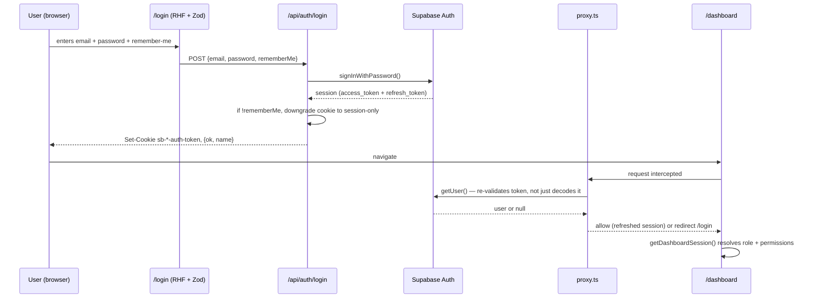
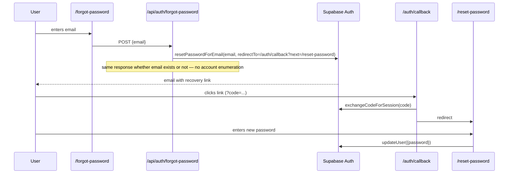
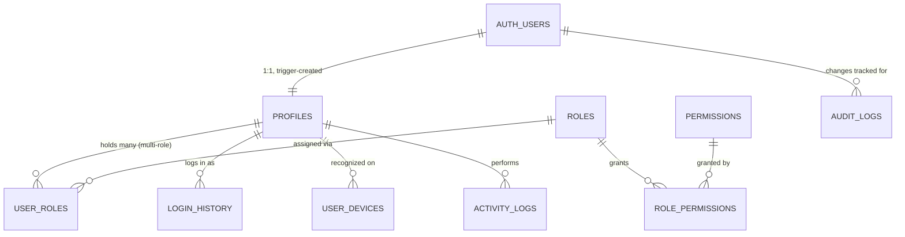
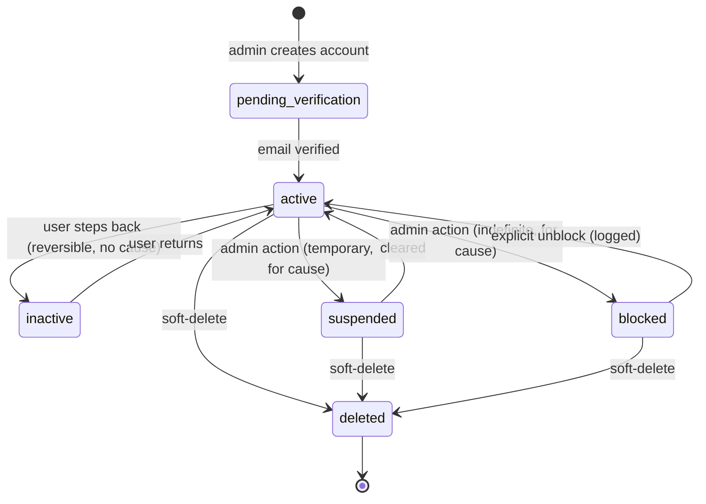
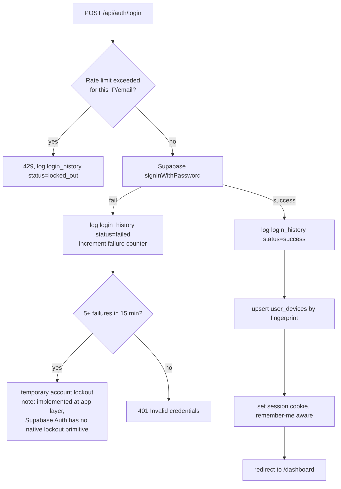
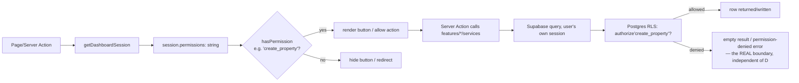
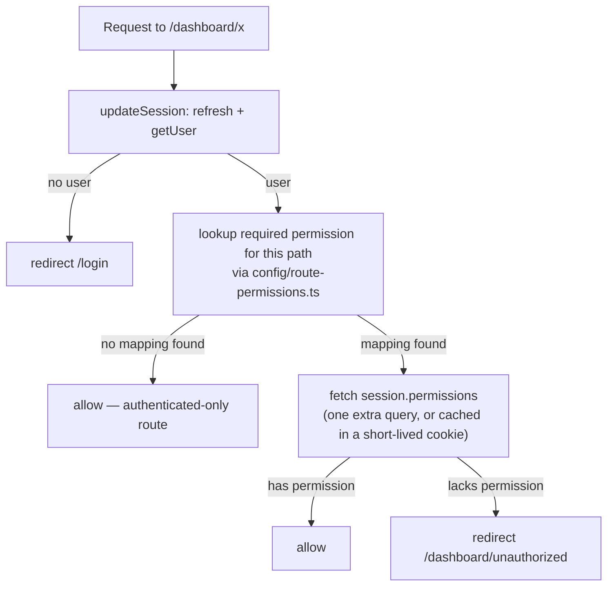

# Everloft Authentication, Authorization & RBAC Architecture

**Status**: Official architecture for identity, access control, and security across Everloft.
**Scope**: authentication/authorization/security only — no property/booking/revenue modules (see
`docs/DATABASE_DESIGN.md` for those).
**Relationship to the live system**: unlike `docs/ARCHITECTURE.md` and `docs/DATABASE_DESIGN.md`
(which describe mostly *unbuilt* modules), a real, substantial part of this document is **already
implemented and in production** — real Supabase Auth, real RLS, real RBAC tables, 11 real roles,
7 real user accounts actively logging in. This document distinguishes ✅ **live** from 🔲 **gap
— designed here, not yet applied** throughout, and §16 gives the concrete migration plan for
every gap. Nothing in this document was applied to the live database while writing it — see the
closing section for what's ready to run when you say go.

---

## 1. Authentication flow diagram



**Why `getUser()` and not just decoding the JWT client-side**: a JWT can be decoded without
calling Supabase, but that only proves the token is *well-formed* — not that the session hasn't
been revoked (logout-everywhere, admin-forced sign-out). `proxy.ts` already calls `getUser()`
specifically because it re-checks against Supabase, matching Supabase's own documented guidance —
this is already correct in the live code (`lib/supabase/middleware.ts`), called out here so it's
never "optimized" into a cheaper local-decode later.

**Forgot password / reset flow** (✅ live):


---

## 2. RBAC architecture diagram

```mermaid
graph LR
    subgraph Identity
        AU[auth.users<br/>Supabase-managed credentials]
        P[profiles<br/>1:1, human-facing]
    end
    subgraph RBAC["RBAC — pure data, never hardcoded"]
        UR[user_roles<br/>M:M, one is_primary]
        R[roles<br/>11 seeded]
        RP[role_permissions<br/>M:M]
        PERM[permissions<br/>catalogue]
    end
    subgraph Enforcement
        RLS[Postgres RLS<br/>authorize/has_role functions]
        APP[App-level hasPermission()<br/>UX only, never the real boundary]
    end

    AU -->|1:1, trigger-created| P
    P -->|"can hold many"| UR
    UR --> R
    R --> RP
    RP --> PERM
    UR -.read by.-> RLS
    RP -.read by.-> RLS
    UR -.read by.-> APP
```

**Why permissions are database rows, not TypeScript constants**: every requirement in this
document that says "future permissions must be easily added" or "never hardcode permissions" is
satisfied by one design fact — `permissions`, `role_permissions`, and `roles` are ordinary tables.
Adding a permission, or granting an existing one to a new role, is an `INSERT`/`UPDATE` executed
by a Super Admin (eventually via the Role/Permission Management UI in §14), never a code change
or a deploy. The only place a permission *name* appears in TypeScript is the `PermissionKey`
union in `config/permissions.ts` (per `docs/ARCHITECTURE.md`) — and that exists purely for editor
autocomplete, not as the source of truth; a permission works at runtime the moment it's a row,
whether or not the union has been updated to know its name.

**Why one person can hold multiple roles (already true today)**: `user_roles` has always been a
many-to-many join table with an `is_primary` flag, not a single `role_id` column on `profiles` —
this was a deliberate original design decision (see `supabase/migrations/20260730000004_user_roles.sql`),
made before this request, for exactly the reason this brief states: "Nikhil: Super Admin +
Investor" is a completely ordinary case for a founder/operator who is also a stakeholder.
`is_primary` decides which role's dashboard they land on after login; `authorize()` unions
permissions across **all** their roles, not just the primary one — so a Super Admin who is also
an Investor gets the superset of both roles' permissions, correctly.

---

## 3–4. Database schema & SQL tables

### 3.1 Already live (recap — full detail in `docs/DATABASE_DESIGN.md` §3)
`profiles`, `roles`, `permissions`, `role_permissions`, `user_roles`, `activity_logs`,
`audit_logs` — all with RLS enabled, all with the standard audit columns
(`id/created_at/updated_at/created_by/updated_by/deleted_at`).

### 3.2 Gap 1 — `login_history` (richer than the version in `docs/DATABASE_DESIGN.md` §3.2,
per this brief's explicit field list)

```sql
create table public.login_history (
  id              uuid primary key default gen_random_uuid(),
  user_id         uuid references public.profiles(id),   -- nullable: failed attempts on unknown emails
  attempted_email citext not null,
  ip_address      inet,
  browser         text,
  operating_system text,
  device_type     text,                                   -- desktop | mobile | tablet
  country         text,
  city            text,
  login_at        timestamptz not null default now(),
  logout_at       timestamptz,
  session_duration interval generated always as (logout_at - login_at) stored,
  status          text not null check (status in ('success','failed','locked_out')),
  failure_reason  text,                                    -- invalid_credentials | account_locked | ...
  created_at      timestamptz not null default now(),
  updated_at      timestamptz not null default now(),
  created_by      uuid references auth.users(id),
  updated_by      uuid references auth.users(id),
  deleted_at      timestamptz
);

create index login_history_user_idx on public.login_history (user_id, login_at desc);
create index login_history_ip_idx on public.login_history (ip_address, login_at desc);
create index login_history_failed_idx on public.login_history (attempted_email, login_at desc)
  where status = 'failed';                                -- brute-force detection query

alter table public.login_history enable row level security;
create policy "login_history_select_own_or_reporting" on public.login_history
  for select to authenticated
  using (user_id = auth.uid() or authorize('view_audit_logs'));
```

**Why `session_duration` is a generated column, not computed in application code**: it's derived
purely from two columns on the same row — computing it in Postgres means every report/query gets
a correct value for free, with no risk of a client forgetting to compute it or computing it with
the wrong timezone handling.

**How rows get created without new application code duplicating Supabase's own auth events**:
extend the existing `handle_auth_user_login()` trigger (already live, fires on
`auth.users.last_sign_in_at` change) to also insert into `login_history` with IP/user-agent
parsed from the request — this requires that data to be captured at the `/api/auth/login` route
(where the request object is available) and passed through, since a database trigger on
`auth.users` has no access to the HTTP request. **Concretely**: the login route inserts the
`login_history` row itself (not the trigger) immediately after a successful/failed
`signInWithPassword()` call, where `request.headers` (IP, user-agent) are actually available.

### 3.3 Gap 2 — `user_devices` (trusted device tracking)
```sql
create table public.user_devices (
  id                 uuid primary key default gen_random_uuid(),
  user_id            uuid not null references public.profiles(id) on delete cascade,
  device_fingerprint text not null,        -- hashed client fingerprint, not raw UA string
  device_name        text,                 -- "Chrome on Windows", user-editable label
  is_trusted         boolean not null default false,
  last_seen_at       timestamptz not null default now(),
  last_ip            inet,
  created_at         timestamptz not null default now(),
  updated_at         timestamptz not null default now(),
  created_by         uuid references auth.users(id),
  updated_by         uuid references auth.users(id),
  deleted_at         timestamptz,
  unique (user_id, device_fingerprint)
);

create index user_devices_user_idx on public.user_devices (user_id) where deleted_at is null;

alter table public.user_devices enable row level security;
create policy "user_devices_select_own" on public.user_devices
  for select to authenticated using (user_id = auth.uid());
create policy "user_devices_manage_own" on public.user_devices
  for update to authenticated using (user_id = auth.uid()) with check (user_id = auth.uid());
```
**"Revoke individual session" caveat**: revoking a *device* (deleting/untrusting its row here) is
a UI/bookkeeping action; actually invalidating that device's live session is a Supabase Auth
admin operation (`supabase.auth.admin.signOut(userId, scope: 'others' | 'global')` via the
service-role key), not something this table can do by itself — Supabase owns the actual session/
refresh-token store. `user_devices` is the friendly, queryable index over "what does this user
consider their known devices," not a replacement for Supabase's session store.

### 3.4 Gap 3 — expanded `profiles` columns (additive, non-breaking)
```sql
alter table public.profiles
  add column first_name text,
  add column last_name text,
  add column display_name text,
  add column preferred_theme text not null default 'system'
    check (preferred_theme in ('light','dark','system')),
  add column last_active_at timestamptz;
```
**Why additive, not a rename of `full_name`**: `full_name` is already read by
`getDashboardSession()`, the navbar, and every dashboard greeting today, for 7 real accounts.
Adding `first_name`/`last_name`/`display_name` alongside it (populated by a one-time backfill
splitting existing `full_name` values, then kept in sync going forward by whichever
profile-edit UI is eventually built) avoids a breaking rename touching every existing call site
for zero functional gain right now. `display_name` becomes the "what greeting/avatar-tooltip
shows" field once distinguishing it from `first_name + last_name` matters (nicknames, company
names for institutional investors).
**Why `last_active_at` is separate from the existing `last_login_at`**: "last login" answers
"when did they last authenticate"; "last active" answers "when did they last actually do
anything" (updated by any authenticated request touching the API, not just the login route) — a
user with a 3-day-old browser tab open and no login in that window has a stale `last_login_at`
but a fresh `last_active_at`. Conflating them loses real signal for security review ("this
session has been idle for 6 hours, should it time out?").

### 3.5 Gap 4 — expanded `status` values (breaking-ish: touches a live check constraint)
Live today: `check (status in ('active', 'invited', 'suspended', 'deactivated'))`.
Target: `pending_verification, active, inactive, suspended, blocked, deleted`.
```sql
-- Migrate existing values forward before changing the constraint:
update public.profiles set status = 'pending_verification' where status = 'invited';
update public.profiles set status = 'deleted' where status = 'deactivated';

alter table public.profiles drop constraint profiles_status_check;
alter table public.profiles add constraint profiles_status_check
  check (status in ('pending_verification','active','inactive','suspended','blocked','deleted'));
```
**Why this needs care before running, unlike the purely additive gaps above**: this rewrites the
meaning of existing rows (all 7 real accounts are currently `'active'`, unaffected, but the
mapping of `invited`→`pending_verification` and `deactivated`→`deleted` is a judgment call worth
a human sign-off, not something to silently apply — flagged explicitly rather than bundled in
with the safe additive changes.
**Semantic distinction, `inactive` vs. `suspended` vs. `blocked` vs. `deleted`**: `inactive` = the
account holder chose to step back (e.g. an investor between deals) — reversible, no wrongdoing
implied. `suspended` = admin-initiated, temporary, for cause (e.g. pending an investigation) —
reversible. `blocked` = admin-initiated, indefinite, for cause (e.g. confirmed policy violation)
— reversible only by explicit unblock action, logged. `deleted` = soft-deleted per the platform's
"never hard-delete" rule — `deleted_at` is also set at the same time, and this status value exists
so a *reason* ("this profile is gone because status=deleted," not merely "some deleted_at
timestamp exists") is queryable without inferring intent from a timestamp alone.

### 3.6 Gap 5 — granular permission catalogue (additive seed rows, replaces coarse grants)
The live seed (`role_permissions` §"seed_rbac_data.sql") uses coarse permissions
(`manage_properties`, `manage_bookings`, ...). This brief asks for CRUD-level granularity. Both
can coexist during a transition, but the target is genuinely one-permission-per-action:
```sql
insert into public.permissions (key, name, category) values
  ('view_properties',   'View Properties',    'properties'),
  ('create_property',   'Create Property',    'properties'),
  ('edit_property',     'Edit Property',      'properties'),
  ('delete_property',   'Delete Property',    'properties'),
  ('archive_property',  'Archive Property',   'properties'),
  ('view_bookings',     'View Bookings',      'bookings'),
  ('create_booking',    'Create Booking',     'bookings'),
  ('cancel_booking',    'Cancel Booking',     'bookings'),
  ('view_revenue',      'View Revenue',       'finance'),
  ('manage_documents',  'Manage Documents',   'documents'),
  ('manage_notifications','Manage Notifications','notifications'),
  ('view_audit_logs',   'View Audit Logs',    'security'),
  ('view_activity_logs','View Activity Logs', 'security')
on conflict (key) do nothing;
-- (view_expenses, view_reports already exist in the live seed)
```
**Why not simply delete the coarse ones**: `manage_properties` etc. may already be relied on by
UI code once the Properties module (`docs/ARCHITECTURE.md`) is built against whatever's live at
that time. The migration plan (§16) is: add the granular permissions now, grant them to the same
roles that hold the coarse equivalent, build new features against the granular set exclusively,
and deprecate (stop granting, eventually delete) the coarse ones only once nothing references
them — never a same-day swap on a live system.

### 3.7 Default roles — reconciling this brief's naming with what's live
This brief lists: Super Admin, **Operations Admin**, Finance, Property Owner, Investor,
Housekeeping, Maintenance, **Customer Support**, Guest, Future Custom Role. The live seed uses
`operations_manager` and `guest_support` for the same two concepts (from the original legacy-site
role names — see `web/CLAUDE.md`). **Recommendation: don't rename the live slugs** —
`role.slug` is referenced by `roleToDashboardSlug()` and every dashboard route
(`/dashboard/operations-manager`) for 7 real accounts today; `role.name` (the *display* label,
"Operations Manager") already reads naturally and doesn't need to literally match this brief's
wording. If "Operations Admin"/"Customer Support" as exact display strings matter, that's a
one-row `UPDATE roles SET name = ... WHERE slug = ...`, not a structural change. "Future Custom
Role" isn't a row to seed — it's the *capability* (§2's "why permissions are database rows")
already satisfied by the schema; no placeholder row is needed for a capability that already works.

---

## 5. Entity relationship diagram



---

## 6. User lifecycle


**Why self-registration stays off** (already the case — `enable_signup = false` in
`supabase/config.toml`): every account here is admin-provisioned, matching how a PMS actually
onboards staff/owners/investors — see `README.md`'s "Create your first user." A new account is
created directly in `active` or `pending_verification` state by an admin via the Supabase Admin
API (exactly the mechanism already used to create the 7 real accounts), never via a public
sign-up form.

---

## 7. Login flow (detailed, including the security gaps this brief calls for)



**Rate limiting / brute-force / lockout — none of this exists yet, design here**:
Supabase Auth itself has no built-in per-account lockout counter exposed to the app. The
recommended design: a lightweight counter derived from `login_history` itself —
`select count(*) from login_history where attempted_email = $1 and status = 'failed' and
login_at > now() - interval '15 minutes'` — checked by the `/api/auth/login` route *before*
calling Supabase, short-circuiting with a `429`/locked-out response once the threshold is
crossed, and logged as `status = 'locked_out'` (distinct from `'failed'`, so a lockout doesn't
inflate the failure count it was triggered by). **IP-level rate limiting** (independent of which
email is being tried, to stop credential-stuffing across many accounts from one source) belongs
at the edge — Vercel/Cloudflare — not in application code; recommend Upstash's Redis-based rate
limiter (`@upstash/ratelimit`) in `proxy.ts` ahead of the auth routes once real traffic exists.
**Suspicious login detection** (new country/device for a known user): compare the incoming
login's `country`/`device_fingerprint` against that user's `login_history`/`user_devices` history
at login time; if novel, still allow the login (don't block a legitimate traveling user) but fire
a `notifications` row + email alert — a detection-and-alert design, not a blocking one, appropriate
for this platform's current scale.

---

## 8. Permission flow



**The one sentence that matters most in this whole document**: step D (`hasPermission()` in the
UI) is a courtesy that makes the product feel right — it is not, and must never be treated as,
the actual security control. Step I (Postgres RLS via `authorize()`) is the actual security
control. A bug in step D that shows a button it shouldn't is a UX bug. A bug in step I is a data
breach. Every future feature must be built with that asymmetry in mind — already true for
everything live today (RLS enabled on every table, per `docs/DATABASE_DESIGN.md` §1).

---

## 9. Middleware flow (`proxy.ts`)

Live today (`src/proxy.ts`): refresh session → if `/dashboard/*` and no user, redirect to
`/login?next=...`; if `/login` and already authenticated, redirect to `/dashboard`. This is
**authentication** middleware (are you logged in at all) — it does not yet do **authorization**
per-route (are you allowed on *this specific* dashboard route). Target design, additive:



**Why this isn't built yet even though `proxy.ts` exists**: middleware/edge runtime historically
has restrictions on full Postgres queries per-request; the pragmatic implementation is a small,
explicit `config/route-permissions.ts` map (`{'/dashboard/users': 'manage_users', ...}`) checked
against the permission list already resolved once per session (cached, not re-queried on every
navigation) rather than a live DB call inside the middleware itself on every request. This keeps
the middleware fast while still enforcing route-level authorization before a page even renders,
with RLS as the unconditional backstop regardless of whether this map is kept perfectly in sync.

---

## 10. Route protection strategy

| Route | Auth required | Permission required | Enforcement layers |
|---|---|---|---|
| `/dashboard` | ✅ | — (role-routed) | proxy.ts (auth) |
| `/dashboard/{role-slug}` | ✅ | must match session's own role slug (already enforced — mismatched slug redirects, live today) | proxy.ts + page-level check (live) |
| `/dashboard/properties` (future) | ✅ | `view_properties` | proxy.ts + route-permission map (§9, gap) + RLS |
| `/dashboard/users` (future) | ✅ | `manage_users` | same |
| `/dashboard/revenue` (future) | ✅ | `view_revenue` | same |
| `/dashboard/settings` (future) | ✅ | `manage_settings` | same |
| `/dashboard/property/[assetId]` | ✅ | Super Admin only (hardcoded role check — live today) | page-level check (live); **recommend migrating to a real `view_properties`-style permission check once the granular catalogue (§3.6) exists**, rather than a hardcoded `role === 'super_admin'` string comparison, so a future "Regional Admin" role could be granted the same access without a code change |

**Defense in depth, stated once for the whole table**: every row above has three layers —
middleware (fast, coarse), page-level/service-level check (specific, explains *why* to the user
instead of a silent 404), and RLS (unconditional, the only one that can't be bypassed by a bug in
the other two).

---

## 11. Session management strategy

- **Session storage**: Supabase Auth's own httpOnly cookies via `@supabase/ssr`, refreshed by
  `proxy.ts` on every request — already live, already correct (access tokens expire hourly,
  refresh tokens rotate).
- **Remember me** (✅ live): unchecked → cookie downgraded to session-only (no `maxAge`) at the
  `/api/auth/login` route, so it clears when the browser closes; checked → Supabase's normal
  longer-lived refresh cookie stands.
- **Active/expired/revoked sessions** (🔲 gap — UI, not schema): Supabase Auth already tracks
  sessions server-side; there's no need for a parallel `sessions` table (see principle in
  `docs/DATABASE_DESIGN.md` §3 — don't duplicate what Supabase manages). What's missing is a UI
  surface: an "Active Sessions" page (§14) calling `supabase.auth.admin.listUserSessions()` (or,
  from the user's own session, whatever self-service session-listing Supabase's client exposes)
  and a "Sign out everywhere" button calling `supabase.auth.signOut({scope: 'global'})`.
- **Change password while logged in** (🔲 gap, distinct from the existing forgot/reset flow):
  `POST /api/auth/change-password` — requires the *current* password re-entered (not just a
  valid session) before calling `supabase.auth.updateUser({password})`, specifically so a
  stolen/left-open session alone isn't sufficient to take over the account by changing its
  password — a meaningfully different security property than the reset-via-email flow, which is
  why it's a separate endpoint/screen (§14) rather than reusing `/reset-password`.

---

## 12. Security best practices

| Concern | Status | Detail |
|---|---|---|
| Row Level Security | ✅ live | every table, `authorize()`/`has_role()` helpers |
| JWT validation | ✅ live | `getUser()` in `proxy.ts` re-validates against Supabase, never trusts a locally-decoded token |
| Secure cookies | ✅ live | httpOnly, `sameSite: lax`, set via `@supabase/ssr`'s adapter |
| Environment variables | ✅ live | `.env` gitignored, `.env.example` documents shape without real values |
| CSRF protection | ✅ largely by construction | `sameSite: lax` cookies + Supabase's bearer-token model mean state-changing requests aren't cookie-riding-vulnerable the way classic session-cookie apps are; **recommend adding an explicit `Origin` header check on mutating Route Handlers** as defense in depth once external-facing forms (contact, lead forms) see real traffic |
| XSS protection | ✅ mostly by construction | React escapes by default; **audit any `dangerouslySetInnerHTML` usage** (none currently in auth-related code) and add a Content-Security-Policy header (🔲 gap — recommend `next.config.ts` headers) |
| SQL injection protection | ✅ by construction | all queries go through Supabase's PostgREST/`supabase-js` client (parameterized), never raw string-concatenated SQL — this is a load-bearing reason the "no inline Supabase queries outside `services/`" rule in `docs/ARCHITECTURE.md` matters: it keeps every query going through the one client that can't be accidentally string-concatenated |
| Secure headers | 🔲 gap | `next.config.ts` should set `Strict-Transport-Security`, `X-Content-Type-Options: nosniff`, `X-Frame-Options: DENY`, `Content-Security-Policy` — none configured yet |
| Rate limiting | 🔲 gap | see §7 — Upstash at the edge, recommended before launch |
| Input validation | ✅ live | Zod schemas on every auth form (`login`, `forgot-password`, `reset-password`) validate both client- and server-side from the same schema |
| Output escaping | ✅ by construction | React/JSX default; no raw HTML interpolation in auth screens |

---

## 13. Folder structure (auth/RBAC slice of `docs/ARCHITECTURE.md`'s target)

```
features/auth/
├── components/      LoginForm, ForgotPasswordForm, ResetPasswordForm, ChangePasswordForm,
│                    ActiveSessionsList, DeviceList
├── hooks/           useSession, useActiveSessions, useDevices
├── services/        auth.service.ts (signIn/signOut/resetPassword/changePassword — wraps
│                    lib/supabase, the only place in this feature that does)
├── actions/         changePasswordAction, revokeSessionAction, revokeDeviceAction
├── types/           AuthSession, LoginHistoryEntry, UserDevice
├── schemas/         loginSchema, forgotPasswordSchema, resetPasswordSchema,
│                    changePasswordSchema (password-policy Zod rules, §"password policy" below)
└── index.ts

features/roles/            # Role & Permission Management UI (§14)
├── components/      RoleTable, RoleForm, PermissionMatrix
├── services/        roles.service.ts
└── ...

features/users/             # User Management UI (§14)
├── components/      UserTable, UserForm, UserStatusBadge
├── services/        users.service.ts
└── ...

lib/rbac/            (exists) permissions.ts, + guards.ts (requirePermission() server helper)
config/route-permissions.ts   (gap, §9) — the route → permission map
```

**Password policy as a Zod schema** (🔲 gap — currently `reset-password` only checks min-length 8):
```ts
export const passwordSchema = z.string()
  .min(8, "At least 8 characters")
  .regex(/[A-Z]/, "At least one uppercase letter")
  .regex(/[a-z]/, "At least one lowercase letter")
  .regex(/[0-9]/, "At least one number")
  .regex(/[^A-Za-z0-9]/, "At least one special character");
```
A strength-meter component (`components/shared/PasswordStrengthMeter`) scores against this same
schema's individual rules client-side for live feedback — never a separate, divergent scoring
algorithm from what the server actually enforces.

---

## 14. API structure & UI specifications

### API routes — existing vs. gap
| Route | Status |
|---|---|
| `POST /api/auth/login` | ✅ live |
| `POST /api/auth/logout` | ✅ live |
| `POST /api/auth/forgot-password` | ✅ live |
| `POST /api/auth/reset-password` | ✅ live |
| `GET /auth/callback` | ✅ live |
| `POST /api/auth/change-password` | 🔲 gap — requires current password, see §11 |
| `GET /api/auth/sessions` | 🔲 gap — list active sessions/devices |
| `POST /api/auth/sessions/revoke` | 🔲 gap — revoke one device/session |
| `POST /api/auth/sessions/revoke-all` | 🔲 gap — sign out everywhere |
| `GET/POST /api/roles`, `/api/permissions`, `/api/role-permissions` | 🔲 gap — backs Role/Permission Management UI |
| `GET/POST /api/users` | 🔲 gap — backs User Management UI |

### UI specifications (wireframe-level — layout, fields, actions; not implemented)

**Login** (✅ built, matches spec): centered two-panel card, brand panel (logo, benefits list)
left, form right — email, password, remember-me checkbox, forgot-password link, submit, "Back to
Home." Already exists at `(site)/login/page.tsx`.

**Forgot Password** (✅ built): centered single card — email field, submit → success state
("check your email," same message regardless of whether the account exists).

**Reset Password** (✅ built): centered single card — new password, confirm password, submit.

**Change Password** (🔲 gap): settings-page section — current password, new password (with
strength meter), confirm new password. Distinct from Reset in that it requires the *current*
password, not a fresh email link.

**Profile** (🔲 gap): form — avatar upload (via `lib/storage/r2.ts`, bucket TBD e.g.
`profile-avatars`), first name, last name, display name, phone, country/state/city, language,
timezone, currency, preferred theme (light/dark/system toggle). Read-only: email (changing email
is a distinct, higher-friction Supabase flow — email-change confirmation — not part of this
form), last login, last active.

**Security Settings** (🔲 gap): a hub page linking to Change Password, Active Sessions, and (once
built) 2FA enrollment — plus a read-only recent login history table (IP, device, location, time,
status) sourced from `login_history`.

**Active Sessions** (🔲 gap): table — device name/type, browser/OS, location (from last
`login_history` entry per device), last active, "this device" badge on the current session,
per-row "Revoke" button, top-level "Sign out of all other sessions" button.

**Role Management** (🔲 gap, Super Admin only, gated by `manage_roles`): table of roles (name,
slug, level, is_system, user count) — "New Role" form (name, slug, description, level); clicking
a role opens its **Permission Matrix**.

**Permission Management** (🔲 gap, gated by `manage_permissions`): a checkbox matrix — rows are
permissions grouped by `category`, columns are roles — checking a cell inserts/deletes the
matching `role_permissions` row. This single screen is the literal UI embodiment of "permissions
come from the database, never hardcoded."

**User Management** (🔲 gap, gated by `manage_users`): table — name, email, roles (badges, since
a user may hold several), status, last active, "Invite User" action (creates via Admin API +
assigns initial role, the same mechanism already used to provision the 7 real accounts), row
actions: edit roles, change status, view login history, force sign-out.

---

## 15. Example seed data

Already live and real (not illustrative) — see the conversation's provisioning step:

| Email | Role(s) | Status |
|---|---|---|
| `superadmin@everloft.co.in` | Super Admin | active |
| `opsadmin@everloft.co.in` | Operations Manager | active |
| `investor01@everloft.co.in` | Investor | active |
| `owner01@everloft.co.in` | Property Owner | active |
| `guest01@everloft.co.in` | Guest | active |
| `housekeep01@everloft.co.in` | Housekeeping | active |
| `maint01@everloft.co.in` | Maintenance | active |

**Worth doing to actually demonstrate the multi-role model this brief emphasizes**: none of the 7
real accounts above currently holds more than one role — the schema supports it (§2), but there's
no live example of it yet. A natural real demonstration: grant `superadmin@everloft.co.in` a
second row in `user_roles` for the `investor` role with `is_primary = false`, proving "Nikhil:
Super Admin + Investor" isn't just a diagram — flagged as a one-`INSERT` action to take if/when
useful, not done automatically here.

---

## 16. Future expansion strategy

| Feature | Readiness today | What "enabling later" actually requires |
|---|---|---|
| Google Login | Config stub exists, disabled (`supabase/config.toml` `[auth.external.google]`) | Real OAuth client ID/secret (Google Cloud Console) + `enabled = true` + an "or continue with Google" button calling `supabase.auth.signInWithOAuth({provider:'google'})`. No schema change — `auth.users`/`profiles` already handle any provider identically. |
| Apple / Microsoft Login | Not stubbed yet | Same pattern as Google — Supabase supports both natively; add their config blocks when credentials exist. |
| Magic Link Login | Auth callback route (`/auth/callback`) already handles the code-exchange generically | Add a "Send me a magic link" option on `/login` calling `supabase.auth.signInWithOtp({email})` — the callback route needs no changes, it already exists for exactly this. |
| 2FA (TOTP) | Config stub exists, disabled (`[auth.mfa.totp]`) | Enable in config, build an enrollment screen (QR code + verification) and a challenge step in the login flow when a factor exists — Supabase's MFA API handles the TOTP secret/verification itself. |
| Passkeys / WebAuthn | Not stubbed | Supabase doesn't natively support WebAuthn as of this writing — would require a third-party WebAuthn library issuing a Supabase session via a custom token exchange. Flagged as the one item here needing real research before design, not a simple config flip. |
| SSO (SAML/OIDC) | Not stubbed | Supabase Auth supports SAML SSO on paid tiers — becomes relevant once a large owner/investor organization requires it (enterprise-tier feature, gated by real customer demand, not built speculatively). |
| Multi-tenant (companies/brands/white-label) | Not built into any auth table | Additive `company_id` on `profiles` (nullable today, required once multi-tenant), cascaded into RLS via a `current_company_id()` helper used alongside `authorize()` — exactly the same pattern already flagged in `docs/DATABASE_DESIGN.md` §20 for the business-data tables. Authentication itself doesn't need to "know" about companies until that column exists; nothing about today's design blocks adding it. |

---

## 17. What's ready to apply, and what needs a decision first

**Safe to apply as-is (additive, non-breaking) whenever you say go**: `login_history`,
`user_devices` (§3.2–3.3), the `profiles` column additions (§3.4), the granular permission seed
additions (§3.6).

**Needs a decision before applying**: the `status` check-constraint change (§3.5) — the
`invited`→`pending_verification` and `deactivated`→`deleted` value mapping is a judgment call
worth confirming, even though no live account is currently affected.

**Real build work, not just migrations**: rate limiting, account lockout, the route-permission
middleware map (§9), and all six UI screens in §14 (Change Password, Profile, Security Settings,
Active Sessions, Role Management, Permission Management, User Management) — these are genuine
feature implementations this document deliberately did not build, matching this task's own scope
("design ... Architecture Document"), not oversights.
