# Everloft Database Design Document

**Status**: Official target database design for the Everloft Hospitality Asset Management
Platform (HAMP), covering all 15 business modules for a 10-year scaling horizon.
**Scope**: schema design only. No frontend, no UI, no business logic — see
`docs/ARCHITECTURE.md` for the application architecture this schema serves.
**Relationship to the live database**: a real Supabase Postgres project already exists and is in
production use (see `web/CLAUDE.md`). Module 1 (Authentication) and part of Module 2 (the
`properties` foundation table) are **already built and live** — this document extends them
rather than replacing them, and §21 spells out exactly how the two states reconcile.

---

## 1. Design principles (read this before any table below)

1. **UUID primary keys everywhere** (`gen_random_uuid()`), never auto-increment integers —
   required for multi-region writes, merge-safe imports (OTA sync), and so a property/booking ID
   never leaks a "how many rows do we have" business metric.
2. **Every table has the same six audit columns.** Rather than repeat them 90 times below, they
   are defined once here and assumed on **every table in this document unless explicitly marked
   "no audit columns"**:
   ```sql
   id          uuid primary key default gen_random_uuid(),
   created_at  timestamptz not null default now(),
   updated_at  timestamptz not null default now(),
   created_by  uuid references auth.users(id),
   updated_by  uuid references auth.users(id),
   deleted_at  timestamptz          -- soft delete; nothing is ever hard-deleted
   ```
   Every table also gets the `set_updated_at()` and `set_audit_columns()` triggers and a partial
   index pattern of `where deleted_at is null` on any column used for filtering/joins — exactly
   the pattern already established in `supabase/migrations/20260730000001_extensions_and_helpers.sql`.
3. **Normalize; don't invent a new table per enum value.** Three places where the literal module
   list above would create duplicate-shaped tables are deliberately unified, with reasoning given
   at each: utility bills (§11), vendors (§8/§10), and the financial ledger (§7). This is what
   "proper normalization, avoid duplicate data, enterprise SaaS standards" means in practice, not
   a deviation from the brief.
4. **Users vs. Profiles are not duplicated.** Supabase Auth's `auth.users` (Supabase-managed,
   holds credentials, sessions, MFA state) *is* "Users." `public.profiles` is the 1:1 human-facing
   extension already built. This document does **not** add a redundant custom `users` table —
   that would require manually re-implementing password hashing, session/token rotation, and
   email verification that Supabase Auth already does correctly. Every other module's "who did
   this" column is a `uuid references auth.users(id)` or, for anything needing joins to
   name/email/avatar, `references public.profiles(id)`.
5. **Files never live in Postgres.** Every `*_photos`, `*_videos`, `*_documents` table below is a
   **thin junction** referencing the already-built `public.files` table (bucket/object_key/
   public_url/signed-URL metadata only) — never a re-declaration of storage columns.
6. **Lookup values are tables, not check-constraint enums**, wherever the business will plausibly
   want to add one without a deploy (property types, booking sources, expense categories, ...).
   The existing `properties.status`/`properties.type` check constraints are a pragmatic MVP
   choice for the foundation table (see `web/CLAUDE.md`) — this document's target design promotes
   them to proper lookup tables, consistent with the "permissions are data, not code" philosophy
   already established for RBAC.

---

## 2. Naming conventions & database standards

| Thing | Convention | Example |
|---|---|---|
| Tables | `snake_case`, plural | `booking_payments`, `property_owners` |
| Columns | `snake_case` | `check_in_date`, `owner_share_percent` |
| Primary key | always `id uuid` | — |
| Foreign key | `<singular_referenced_table>_id` | `property_id`, `booking_id`, `owner_id` |
| Junction tables | `<table_a>_<table_b>` (alphabetical or dependency order, whichever reads more naturally) | `property_amenities`, `booking_guests` |
| Lookup/master tables | `<domain>_types`, `<domain>_categories`, `<domain>_status`, or `<domain>_master` | `property_types`, `expense_categories`, `amenity_master` |
| Boolean columns | `is_<adjective>` or `has_<noun>` | `is_primary`, `has_pool` |
| Money columns | `numeric(14,2)` + a paired `currency` column (never float) | `amount numeric(14,2), currency text` |
| Percentages | `numeric(5,2)` (supports 0.00–100.00 with 2 decimals) | `ownership_percent` |
| Timestamps | `timestamptz`, never bare `timestamp` | `check_in_date timestamptz` |
| Enums via check constraint (only for values that will realistically never need a business-user-editable list) | `text check (col in (...))` | `audit_logs.action` |
| Indexes | `<table>_<column(s)>_idx` | `bookings_property_id_idx` |
| Unique constraints | `<table>_<column(s)>_key` | `properties_slug_key` |

---

## 3. Module 1 — Authentication ✅ (already live, extending it)

| Table | Status | Notes |
|---|---|---|
| **Users** | ✅ live as `auth.users` | Supabase-managed. Not a custom table — see principle #4. |
| **profiles** | ✅ live | 1:1 with `auth.users`, auto-created by trigger. Columns: `full_name, email(citext), phone, country, state, city, avatar_url, language, timezone, currency, status, last_login_at`. |
| **roles** | ✅ live | `slug, name, description, level, is_system`. |
| **permissions** | ✅ live | `key, name, description, category`. |
| **role_permissions** | ✅ live | junction, `(role_id, permission_id)` unique. |
| **user_roles** | ✅ live | junction, `(user_id, role_id)` unique, `is_primary` bool, partial unique index enforcing one primary role per user. |
| **activity_logs** | ✅ live | human-readable feed: `user_id, action, entity_type, entity_id, metadata jsonb, ip_address, user_agent`. |
| **audit_logs** | ✅ live | mechanical diff: `table_name, record_id, action, old_values jsonb, new_values jsonb, changed_by`, populated by the generic `record_audit_log()` trigger — every new table below should attach this trigger. |

### 3.1 `user_devices` 🔲 target (new)
**Purpose**: security-facing device tracking ("where am I logged in") — something Supabase Auth's
internal session table doesn't expose as a friendly, queryable/reportable surface.
| Column | Type | Notes |
|---|---|---|
| `user_id` | uuid → `profiles.id` | |
| `device_fingerprint` | text | hashed client fingerprint |
| `device_name` | text nullable | "Chrome on Windows" |
| `ip_address` | inet | |
| `last_seen_at` | timestamptz | |
| `is_trusted` | boolean default false | |
**Indexes**: `(user_id) where deleted_at is null`. **Relationships**: M:1 → profiles.

### 3.2 `login_history` 🔲 target (new)
**Purpose**: security/fraud-review-optimized login record, distinct from the general
`activity_logs` feed — needs different query patterns (by IP range, failed-attempt clustering,
device) that don't belong mixed into a general activity table.
| Column | Type | Notes |
|---|---|---|
| `user_id` | uuid nullable → `profiles.id` | nullable: failed logins with unknown email |
| `attempted_email` | citext | what was typed, even if it didn't match a real account |
| `success` | boolean | |
| `failure_reason` | text nullable | `invalid_credentials`, `account_locked`, ... |
| `ip_address` | inet | |
| `user_agent` | text | |
**Indexes**: `(user_id, created_at desc)`, `(ip_address, created_at desc)`, `(success) where not success` (fast "recent failed logins" query for security review).

### 3.3 Password reset — **deliberately not a custom table**
Supabase Auth's built-in `resetPasswordForEmail`/recovery-link flow (already wired at
`/forgot-password`, `/reset-password`) manages reset tokens internally, expired securely, single
use. A hand-rolled `password_reset_tokens` table would duplicate this and very likely reintroduce
a class of security bugs Supabase's implementation already avoids (token reuse, timing attacks,
expiry drift). **Do not build this table.**

---

## 4. Module 2 — Property Management

### 4.1 `properties` ✅ live (foundation), extending
Already live: `name, slug, type, status, country, state, city, address, latitude, longitude,
timezone, currency, owner_id, primary_investor_id, managed_by`. Target design **promotes**
`type`/`status` from check constraints to FKs into the new lookup tables below (§4.2, §4.3) —
additive migration: add nullable `type_id`/`status_id` columns, backfill from the existing text
columns, then deprecate the text columns once the app reads from the new FKs. Also **promotes**
`owner_id`/`primary_investor_id`/`managed_by` (single FK each) to proper many-to-many junction
tables (§4.6–4.8) for the realistic case of co-owned properties/multiple investors/a management
team — the existing single FKs become "primary" convenience columns, kept for cheap common-case
reads, while the junctions hold full multi-party truth.

### 4.2 `property_types` 🔲 (lookup, replaces the `type` check constraint)
`slug` (villa, apartment, penthouse, boutique_stay, holiday_home, other), `name`, `description`.

### 4.3 `property_status` 🔲 (lookup, replaces the `status` check constraint)
`slug` (onboarding, active, inactive, archived), `name`, `sort_order` (for consistent UI ordering).

### 4.4 `property_categories` 🔲 (new — tier, distinct from type)
**Purpose**: "budget / premium / luxury" market positioning — orthogonal to physical type (a
villa can be budget or luxury). `slug, name, description`.

### 4.5 `amenity_master` 🔲
Master list: `name, icon, category` (e.g. "Pool" under category "Outdoor").

### 4.6 `property_amenities` 🔲 (junction, M:M)
`(property_id, amenity_id)` unique, `notes` nullable (e.g. "Pool — seasonal, closed Nov–Feb").

### 4.7 `property_owners` 🔲 (junction, M:M — replaces single `owner_id`)
`property_id, owner_id → profiles.id, ownership_percent numeric(5,2), is_primary boolean,
effective_from date, effective_to date nullable`. **Business rule**: `sum(ownership_percent)` per
`property_id` should equal 100 — enforced at the application/service layer (a DB constraint
across grouped rows needs a trigger; recommended as a `before insert/update` check function once
this table is built, not a plain `check` constraint).

### 4.8 `property_investors` 🔲 (junction, M:M — replaces single `primary_investor_id`)
`property_id, investor_id → profiles.id, stake_percent numeric(5,2), investment_id → Module 4's
investment_records.id nullable, is_primary boolean`.

### 4.9 `property_managers` 🔲 (junction, M:M — replaces single `managed_by`)
`property_id, manager_id → profiles.id, assigned_from date, assigned_to date nullable,
is_lead boolean`.

### 4.10 `property_photos` / `property_videos` 🔲 (thin junctions to `files`)
`property_id, file_id → files.id, sort_order int, is_cover boolean, caption text nullable`. Two
separate tables (not one polymorphic "media" table) because photos and videos have different
default sort/display treatment in the UI and different R2 buckets (`property-images` vs.
`property-videos`, already defined in `lib/storage/r2.ts`) — a single table would need a
`media_type` discriminator anyway, so the split simply matches the two buckets 1:1.

### 4.11 `property_documents` 🔲 (thin junction to `files`)
`property_id, file_id → files.id, document_type` (deed, insurance, inspection_report, ...),
`expiry_date date nullable` (for renewable documents — insurance, licenses).

### 4.12 `property_rooms` 🔲
`property_id, name, room_type_id → room_types.id, floor int nullable, area_sqft int nullable`.

### 4.13 `room_types` 🔲 (lookup)
`slug` (bedroom, living_room, studio, ...), `name`.

### 4.14 `beds` 🔲
`room_id → property_rooms.id, bed_type` (king, queen, single, bunk, sofa_bed), `capacity int`.

### 4.15 `sleeping_arrangements` 🔲
**Purpose**: the guest-facing "sleeps 8 across 4 bedrooms" summary — derived from `beds` but
cached here (denormalized on purpose) so the property listing page doesn't need a live join
across rooms→beds on every page view. `property_id, max_guests int, bedroom_count int,
bed_summary jsonb` (e.g. `[{type:"king",count:2},{type:"bunk",count:1}]`), regenerated by a
trigger on `beds` changes.

### 4.16 `property_rules` 🔲
`property_id, rule_text, sort_order` (house rules list — "no smoking," "no parties," ...).

### 4.17 `property_policies` 🔲
`property_id, policy_type` (cancellation, check_in, check_out, pet, damage_deposit),
`policy_value jsonb` (flexible per type — e.g. cancellation: `{tiers:[{days_before:7,refund_pct:100}]}`).

### 4.18 `nearby_attractions` 🔲
`property_id, name, category` (beach, restaurant, landmark), `distance_km numeric(5,2)`.

### 4.19 `tags` 🔲 + `property_tags` 🔲 (master + junction, M:M)
`tags(name, slug)`; `property_tags(property_id, tag_id)`. Shared master table — reused by any
future taggable entity (bookings, guests), not property-specific by name.

### 4.20 `property_seo` 🔲 (1:1 with properties)
`property_id unique, meta_title, meta_description, og_image_file_id → files.id nullable,
canonical_slug`.

### 4.21 `property_settings` 🔲 (1:1 with properties)
`property_id unique, min_stay_nights int default 1, max_stay_nights int nullable,
check_in_time time, check_out_time time, instant_book boolean default false,
currency_override text nullable`. Kept separate from the `properties` table itself so
frequently-changed operational settings don't bloat the core table's row size or its indexes.

---

## 5. Module 3 — Owners

### 5.1 `owner_details` 🔲 (1:1 extension of `profiles` where role = property_owner)
`profile_id unique → profiles.id, company_name nullable, tax_id nullable, business_type`
(individual, company), `preferred_payout_method`.

### 5.2 `owner_bank_accounts` 🔲
`owner_id → profiles.id, account_holder_name, bank_name, account_number_last4 (text(4)),
account_number_encrypted (see §18 — never store full account number in plaintext), ifsc_or_swift,
is_primary boolean`.

### 5.3 `owner_documents` 🔲 (thin junction to `files`)
`owner_id, file_id → files.id, document_type` (kyc, pan_card, agreement).

### 5.4 `owner_agreements` 🔲
`owner_id, property_id, agreement_type` (full_management, commission_based — matches the two
real partnership models in `web/CLAUDE.md`), `revenue_share_percent numeric(5,2), start_date,
end_date nullable, document_file_id → files.id nullable, status` (draft, active, terminated).

### 5.5 `owner_payouts` 🔲
`owner_id, property_id, period_start date, period_end date, gross_revenue numeric(14,2),
deductions numeric(14,2), net_payout numeric(14,2), currency, status` (pending, paid, failed),
`paid_at timestamptz nullable, transaction_id → transactions.id nullable` (see §7.4).

### 5.6 `owner_statements` 🔲
`owner_id, period_start date, period_end date, file_id → files.id` (the generated PDF statement),
`generated_at timestamptz`.

---

## 6. Module 4 — Investors

### 6.1 `investor_details` 🔲 (1:1 extension of `profiles`)
`profile_id unique → profiles.id, investor_type` (individual, institutional), `accreditation_status`.

### 6.2 `investment_records` 🔲
`investor_id, property_id nullable` (nullable — an investment can be at the company level, not
tied to one property, per the "Development & Primary Share Model" in `web/CLAUDE.md`),
`investment_model` (development_primary_share, long_term_lease, asset_management_partnership —
mirrors the 3 real models), `amount numeric(14,2), currency, invested_at date, status`
(active, exited).

### 6.3 `investor_agreements` 🔲
`investor_id, investment_id → investment_records.id, terms jsonb, document_file_id → files.id,
start_date, end_date nullable`.

### 6.4 `investor_roi` 🔲
`investment_id, period_start date, period_end date, roi_percent numeric(6,2),
cumulative_return numeric(14,2), calculated_at timestamptz`. **Business rule**: append-only —
never update a past period's ROI record; a correction inserts a new row referencing the one it
supersedes (`supersedes_id uuid nullable → self`), preserving historical audit trail for
investor-facing statements.

### 6.5 `investor_statements` 🔲 / `investor_payouts` 🔲
Same shape as owner_statements/owner_payouts (§5.5–5.6), scoped to `investor_id` +
`investment_id` instead of `owner_id`.

### 6.6 `portfolio` 🔲 (materialized view, not a base table)
**Purpose**: "what does this investor's total portfolio look like right now" — an aggregation
across `investment_records` + `investor_roi` + `property_investors`, recomputed on a schedule
(nightly via a Supabase Edge Function cron, per `docs/ARCHITECTURE.md` §14) rather than a live
join on every dashboard view. Designed as a **materialized view**, not a table, specifically
because it is fully derivable from other tables — a real table here would be a second source of
truth that can drift.

---

## 7. Module 5 — Bookings

### 7.1 `booking_status` 🔲 / `booking_source` 🔲 (lookups)
`booking_status`: inquiry, pending_payment, confirmed, checked_in, checked_out, cancelled,
no_show. `booking_source`: direct, airbnb, booking_com, agoda, makemytrip, goibibo (matches the
real OTA list in the original spec and `web/CLAUDE.md`'s "also lists on Airbnb/Booking.com/
MakeMyTrip/Goibibo" business fact) — each row also carries `commission_percent numeric(5,2)
nullable` so channel commission math has one place to live.

### 7.2 `bookings` 🔲 (core table — the busiest table in the system)
| Column | Type | Notes |
|---|---|---|
| `property_id` | uuid → properties | |
| `status_id` | uuid → booking_status | |
| `source_id` | uuid → booking_source | |
| `primary_guest_id` | uuid → guest_profiles | |
| `check_in_date` / `check_out_date` | date | |
| `nights` | int generated always as `(check_out_date - check_in_date)` stored | avoids recomputation everywhere |
| `guest_count` | int | |
| `base_amount`, `cleaning_fee`, `tax_amount`, `total_amount` | numeric(14,2) | |
| `currency` | text | |
| `reservation_code` | text unique | guest-facing confirmation code |
| `external_booking_ref` | text nullable | OTA's own booking ID, for reconciliation |
| `special_requests` | text nullable | |
**Indexes**: `(property_id, check_in_date, check_out_date)` (availability queries — the single
most performance-critical index in the whole schema), `(status_id)`, `(reservation_code)` unique,
`(external_booking_ref) where external_booking_ref is not null`.
**Partitioning** (§15): candidate for range partitioning by `check_in_date` once row count passes
the low millions.

### 7.3 `booking_guests` 🔲 (junction, M:M — a booking can have multiple named guests)
`booking_id, guest_id → guest_profiles.id, is_primary boolean, age_group` (adult, child, infant).

### 7.4 `booking_payments` 🔲
`booking_id, transaction_id → transactions.id` (§7 links to the unified ledger, see below),
`payment_type` (deposit, balance, full, refund), `due_date date nullable`.
**Design note**: `booking_payments` does not itself store `amount`/`currency`/`status` — those
live once, on `transactions`, avoiding the classic "amount stored in three places, one gets
updated and the others don't" bug. `booking_payments` is the *booking-specific context* around a
transaction (what kind of payment this was for this booking), not a duplicate ledger.

### 7.5 `booking_timeline` 🔲
`booking_id, event_type` (created, confirmed, payment_received, checked_in, checked_out,
cancelled, modified), `event_data jsonb, occurred_at timestamptz`. Append-only, drives the
booking detail page's activity feed — same pattern as `activity_logs`, scoped to one booking for
fast per-booking queries instead of filtering the global log.

### 7.6 `booking_notes` 🔲
`booking_id, author_id → profiles.id, note_text, is_internal boolean` (internal ops note vs.
guest-visible note).

### 7.7 `booking_documents` 🔲 (thin junction to `files`)
`booking_id, file_id → files.id, document_type` (invoice, id_scan, signed_agreement).

### 7.8 `booking_refunds` 🔲
`booking_id, transaction_id → transactions.id, reason, refund_amount numeric(14,2),
approved_by → profiles.id nullable, status` (requested, approved, processed, rejected).

---

## 8. Module 6 — Guests

### 8.1 `guest_profiles` 🔲
**Purpose**: deliberately **separate from `public.profiles`** — most guests, especially those
booking through an OTA, never create an Everloft login account at all. `guest_profiles` is a
lightweight CRM-style record; `profile_link_id uuid nullable → profiles.id` connects it *only*
if/when that guest later creates a real account (e.g. for the guest dashboard already built).
`full_name, email nullable, phone nullable, country nullable, date_of_birth nullable`.
**Business rule**: `email`+`phone` together (not alone) are the dedup key when reconciling guests
across repeat bookings and OTA imports — a nullable unique index isn't sufficient here; dedup
logic belongs in the `features/guests/services` layer, not a DB constraint, since fuzzy matching
(same person, different email) is a business decision, not a hard rule.

### 8.2 `guest_documents` 🔲 (thin junction to `files`)
`guest_id, file_id → files.id, document_type` (passport, national_id, visa), `verified boolean
default false, verified_by → profiles.id nullable`.

### 8.3 `guest_reviews` 🔲
`booking_id, guest_id, property_id, rating int check (rating between 1 and 5), title nullable,
comment, stay_month text nullable, response_text nullable` (host reply), `response_at nullable`.

### 8.4 `guest_preferences` 🔲
`guest_id, preference_key, preference_value jsonb` (e.g. `dietary: vegetarian`,
`room_preference: high_floor`) — key-value shape because preference types will grow over time
without needing new columns.

### 8.5 `guest_loyalty` 🔲
`guest_id unique, tier` (bronze, silver, gold), `points_balance int default 0,
lifetime_bookings int default 0, lifetime_spend numeric(14,2) default 0`. Future-ready, not
required for launch — flagged as such.

---

## 9. Module 7 — Revenue (the unified ledger design)

**Why a unified `transactions` ledger instead of separate money-movement tables per module**: the
spec's module list implies revenue payments, owner payouts, investor payouts, and expense
payments could each get their own storage of `amount/currency/status/paid_at`. In an enterprise
financial system, that's the #1 way books stop reconciling — four tables independently tracking
"did this actually get paid," able to drift. This design uses **one ledger** (`transactions`) as
the single source of truth for every money movement, with each domain table (`booking_payments`,
`owner_payouts`, `investor_payouts`, `expenses`) holding only the *context* of why that
transaction happened, referencing it by `transaction_id`.

### 9.1 `transactions` 🔲 (the ledger — single source of truth for money movement)
| Column | Type | Notes |
|---|---|---|
| `direction` | text check (`inbound`,`outbound`) | money coming in (guest payment) vs. going out (payout, refund, expense) |
| `amount` | numeric(14,2) | always positive; `direction` gives sign |
| `currency` | text | |
| `status` | text check (`pending`,`completed`,`failed`,`reversed`) | |
| `payment_method` | text nullable | card, bank_transfer, upi, cash |
| `gateway_reference` | text nullable | Razorpay/payment provider's own transaction ID |
| `related_entity_type` | text | `booking`, `owner_payout`, `investor_payout`, `expense` — for generic reporting joins |
| `related_entity_id` | uuid | polymorphic reference (no FK constraint possible across types — validated at the service layer, indexed for lookups) |
| `settled_at` | timestamptz nullable | |
**Indexes**: `(related_entity_type, related_entity_id)`, `(status, created_at desc)` (fast
"pending transactions" dashboard query).

### 9.2 `revenue_categories` 🔲 (lookup)
`slug` (room_revenue, cleaning_fee, upsell, late_checkout_fee, damage_charge), `name`.

### 9.3 `revenue` 🔲
**Purpose**: the recognized-revenue ledger (accounting concept — distinct from `transactions`,
which is *cash movement*; a booking can recognize revenue before the guest actually pays, or a
transaction can be a deposit against revenue not yet fully earned). `property_id, booking_id
nullable, category_id → revenue_categories.id, amount numeric(14,2), currency,
recognized_date date`.

### 9.4 `revenue_sources` 🔲 (lookup — *what kind of revenue line*, distinct from `booking_source`
which is *what channel the booking came from*)
`slug` (direct_booking, ota_booking, upsell, other), `name`.

### 9.5 `invoices` 🔲
`booking_id nullable, owner_id nullable, investor_id nullable` (an invoice can be guest-facing or
internal to an owner/investor statement cycle), `invoice_number text unique, line_items jsonb,
subtotal, tax_amount, total_amount numeric(14,2), currency, status` (draft, sent, paid, void),
`file_id → files.id nullable` (generated PDF), `due_date date nullable`.

### 9.6 `taxes` 🔲
`jurisdiction` (country/state code), `tax_type` (GST, VAT, occupancy_tax), `rate_percent
numeric(5,2), effective_from date, effective_to date nullable`. Referenced by `invoices`/
`transactions` at calculation time, not stored redundantly per transaction.

### 9.7 `management_fees` 🔲
`property_id, booking_id nullable, period_start date, period_end date, fee_percent
numeric(5,2), fee_amount numeric(14,2), currency, transaction_id → transactions.id nullable`.

### 9.8 `owner_share` 🔲 / `investor_share` 🔲
Both: `property_id, period_start date, period_end date, gross_revenue numeric(14,2),
share_percent numeric(5,2), share_amount numeric(14,2), currency`, plus `owner_id`/`investor_id`
respectively. These are the calculated allocation records that `owner_payouts`/`investor_payouts`
(§5.5, §6.5) get generated *from* — kept separate from the payout tables because "how much they
were owed for this period" (a calculation, auditable, immutable once finalized) is conceptually
distinct from "when/whether they were actually paid" (a payment-workflow state machine).

---

## 10. Module 8 — Expenses

### 10.1 `expense_categories` 🔲 (lookup)
`slug` (utilities, cleaning_supplies, repairs, staff_salary, marketing), `name`.

### 10.2 `vendors` 🔲 (unified — shared with Maintenance §11 and Utilities §12)
**Why unified instead of `expense_vendors` + `maintenance_vendors` as separate tables**: a
plumbing vendor who does maintenance work also submits expense claims and may also be the
utility board's registered agent — modeling them as three disconnected vendor records means
their contact info/tax ID/bank details get entered three times and drift independently. One
`vendors` master table, referenced by `expenses`, `maintenance_tickets`, and
`property_utility_accounts` alike:
`name, vendor_type` (array or separate `vendor_service_types` junction if a vendor spans
categories — recommend a simple `text[]` of tags here since it's descriptive metadata, not a
relationship needing referential integrity), `contact_person, phone, email, tax_id nullable,
bank_account_encrypted nullable, rating numeric(2,1) nullable`.

### 10.3 `expenses` 🔲
`property_id, category_id → expense_categories.id, vendor_id → vendors.id nullable,
transaction_id → transactions.id nullable` (once paid), `description, amount numeric(14,2),
currency, expense_date date, status` (draft, submitted, approved, rejected, paid),
`submitted_by → profiles.id`.

### 10.4 `expense_attachments` 🔲 (thin junction to `files`)
`expense_id, file_id → files.id` (receipts, invoices).

### 10.5 `approvals` 🔲 (generic, polymorphic — reused beyond just expenses)
**Purpose**: rather than a bespoke approval-state-machine per module (expenses need approval,
future maintenance-vendor payouts will too, large owner agreements might), one generic table:
`related_entity_type text, related_entity_id uuid, requested_by → profiles.id, approver_id →
profiles.id nullable, status` (pending, approved, rejected), `decided_at timestamptz nullable,
comments text nullable`. Indexed on `(related_entity_type, related_entity_id)` and
`(approver_id, status) where status = 'pending'` (fast "my pending approvals" widget).

---

## 11. Module 9 — Housekeeping

### 11.1 `cleaning_schedule` 🔲
`property_id, assigned_staff_id → profiles.id, scheduled_date date, scheduled_time time nullable,
booking_id nullable` (turnover cleanings tie to the checkout booking), `status` (scheduled,
in_progress, completed, missed).

### 11.2 `cleaning_checklist_templates` 🔲 + `cleaning_checklist_items` 🔲
Master template (`name, property_type_id nullable` — can be property-type-specific) + ordered
items (`template_id, item_text, sort_order, is_required boolean`). Kept as master template +
items (not one flat table) so editing a template doesn't require rewriting every historical
completed checklist.

### 11.3 `cleaning_reports` 🔲
`schedule_id → cleaning_schedule.id, staff_id, started_at, completed_at nullable, checklist_id →
cleaning_checklist_templates.id, completed_items jsonb` (snapshot of which items were checked, at
completion time — deliberately denormalized/frozen so later template edits don't rewrite
history), `issues_reported text nullable`.

### 11.4 `inspection_photos` 🔲 (thin junction to `files`)
`cleaning_report_id, file_id → files.id, photo_type` (before, after, issue).

---

## 12. Module 10 — Maintenance

### 12.1 `maintenance_types` 🔲 (lookup)
`slug` (plumbing, electrical, appliance, structural, pest_control), `name`.

### 12.2 `maintenance_tickets` 🔲
`property_id, type_id → maintenance_types.id, vendor_id → vendors.id nullable (see §10.2),
reported_by → profiles.id, priority` (low, medium, high, urgent), `description, status` (open,
assigned, in_progress, completed, cancelled), `assigned_to → profiles.id nullable,
estimated_cost numeric(14,2) nullable, actual_cost numeric(14,2) nullable, expense_id →
expenses.id nullable` (once billed).

### 12.3 `maintenance_history` 🔲
`ticket_id, status_from, status_to, changed_by → profiles.id, note text nullable,
changed_at timestamptz`. Append-only status timeline — same append-only pattern as
`booking_timeline`.

### 12.4 `maintenance_photos` 🔲 (thin junction to `files`)
`ticket_id, file_id → files.id, photo_type` (before, after).

---

## 13. Module 11 — Utilities (unified design)

**Why one `utility_bills` table instead of five (`electricity_bills`, `water_bills`,
`internet_bills`, `gas_bills`, `association_fees`)**: all five have the identical shape — a
property, a provider, a billing period, an amount, a due date, a paid status. Splitting them into
five tables means every report that needs "total utility spend this month" runs a five-way
`UNION ALL` instead of one `GROUP BY utility_type`, and adding a sixth utility type (e.g. "waste
management") means a new migration instead of one new lookup row. This is the clearest case in
the whole schema of "don't create a table per enum value."

### 13.1 `utility_types` 🔲 (lookup)
`slug` (electricity, water, internet, gas, association_fee, waste_management), `name`.

### 13.2 `property_utility_accounts` 🔲
`property_id, utility_type_id, provider_name, account_number, vendor_id → vendors.id nullable`.

### 13.3 `utility_bills` 🔲
`utility_account_id → property_utility_accounts.id, billing_period_start date,
billing_period_end date, amount numeric(14,2), currency, due_date date, paid boolean default
false, transaction_id → transactions.id nullable, file_id → files.id nullable` (scanned bill).
**Indexes**: `(utility_account_id, billing_period_start desc)`, `(paid) where not paid` (fast
"unpaid bills" dashboard widget across all utility types at once — the entire reason this design
is unified).

---

## 14. Module 12 — CRM

### 14.1 `contacts` 🔲
**Purpose**: external contacts who are *not* platform users — prospective owners/investors mid
sales-pipeline, vendor contacts, partnership leads. `full_name, email nullable, phone nullable,
company nullable, contact_type` (prospective_owner, prospective_investor, vendor_contact,
partner, other), `converted_to_profile_id uuid nullable → profiles.id` (set once/if they become a
real platform user).

### 14.2 `notes` 🔲 (generic, polymorphic — reused across the app)
`related_entity_type text, related_entity_id uuid, author_id → profiles.id, note_text,
is_pinned boolean default false`. This single table backs notes on contacts, properties, and
bookings alike (`booking_notes` in §7.6 is intentionally kept separate/booking-specific instead
of using this generic table, because booking notes have the extra `is_internal` guest-visibility
flag that doesn't apply to internal CRM notes — a deliberate exception to "always genericize,"
made because the two have genuinely different business rules, not just different tables).

### 14.3 `tasks` 🔲
`title, description nullable, assigned_to → profiles.id, related_entity_type nullable,
related_entity_id uuid nullable, due_date date nullable, status` (todo, in_progress, done,
cancelled), `priority` (low, medium, high).

### 14.4 `follow_ups` 🔲
`contact_id → contacts.id, scheduled_for timestamptz, note text nullable, completed boolean
default false, completed_at timestamptz nullable`.

---

## 15. Module 13 — Notifications ✅ (partially live, extending)

`notifications` ✅ already live: `user_id, title, body, type, action_url, is_read, read_at`.

### 15.1 `notification_templates` 🔲
`slug` (booking_confirmed, payout_processed, maintenance_assigned), `channel` (in_app, email,
sms, push), `subject_template text, body_template text` (with `{{placeholder}}` tokens),
`is_active boolean default true`.

### 15.2 `notification_logs` 🔲
`notification_id nullable → notifications.id, template_id → notification_templates.id, channel,
recipient text` (email/phone, whichever the channel needs), `status` (queued, sent, delivered,
failed, opened), `sent_at timestamptz nullable, error_message text nullable`. Separate from
`notifications` because `notifications` is the *in-app* feed users see; `notification_logs` is
the *delivery audit trail* across every channel (including channels, like email, that never
create an in-app row at all).

---

## 16. Module 14 — Reports

### 16.1 `saved_reports` 🔲
`owner_profile_id → profiles.id, name, report_type` (revenue_summary, occupancy, expense_breakdown),
`filters jsonb` (date range, property filter, etc.), `is_shared boolean default false`
(visible to the whole team vs. just its creator).

### 16.2 `exports` 🔲
`requested_by → profiles.id, export_type, filters jsonb, status` (queued, processing, ready,
failed), `file_id → files.id nullable` (the generated CSV/PDF once ready), `requested_at,
completed_at nullable`. Backs a "my exports" async-download UX rather than blocking a request on
a potentially-slow report generation.

---

## 17. Module 15 — System (reference data)

| Table | Columns | Notes |
|---|---|---|
| `countries` | `iso_code(2) unique, name, phone_code, currency_code` | seed once, rarely changes |
| `states` | `country_id, name, code nullable` | |
| `cities` | `state_id, name` | consider a dedicated geocoding/places API instead of hand-maintaining this at global scale — flagged in §20 |
| `currencies` | `iso_code(3) unique, name, symbol, decimal_places int default 2` | |
| `languages` | `iso_code(2) unique, name, native_name` | |
| `timezones` | `iana_name unique` (e.g. `Asia/Kolkata`) | prefer IANA names over a hand-maintained offset table — offsets change with DST rules, IANA names don't |
| `settings` | `key unique, value jsonb, description, updated_by` | global system settings, versioned by the standard `updated_at`/`updated_by` audit columns — no separate settings-history table needed unless compliance requires it later |

**No audit columns on `countries`/`states`/`cities`/`currencies`/`languages`/`timezones`** —
these are global reference data seeded once, not user-editable business records; `created_at`
alone (for seed provenance) is sufficient. This is the one deliberate exception to principle #2.

---

## 18. Security: sensitive columns & encryption

| Data | Recommendation |
|---|---|
| Owner/vendor bank account numbers | Never store full number in plaintext. Store `account_number_last4` for display + `account_number_encrypted` using Postgres `pgcrypto`'s `pgp_sym_encrypt`, key held in Supabase Vault (not in application code) — decrypt only server-side, only when actually initiating a payout. |
| Guest ID documents (passport, national ID) | Never stored as raw text/number columns — always as a `files` reference (already the pattern), bucket `guest-ids` (already defined), access via short-lived signed URLs only, never a public bucket. |
| Tax IDs (owner/vendor) | Plaintext acceptable (not payment-initiating credentials) but still RLS-restricted to `manage_owners`/`manage_users` permission holders, never guest/investor-visible. |
| `login_history.ip_address` | Retain per a defined window (recommend 12 months) then purge via a scheduled job — even soft-deleted, indefinite IP retention is a privacy-policy liability, not a technical one; flagged for legal review, not solved by schema alone. |

**RLS pattern for every new table**: reuse the existing `authorize(permission_key)` /
`has_role(role_slug)` helper functions (`supabase/migrations/20260730000004_user_roles.sql`) —
never write a bespoke permission join per policy. General shape, consistent with what's already
live:
```sql
create policy "<table>_select_scoped" on public.<table>
  for select to authenticated
  using (
    <owning-relationship column> = auth.uid()
    or authorize('manage_<domain>')
  );
```

---

## 19. Indexing strategy (the tables that matter most under load)

| Table | Critical indexes | Why |
|---|---|---|
| `bookings` | `(property_id, check_in_date, check_out_date)`, `(status_id)`, `(reservation_code)` unique | availability search is the highest-frequency query in the whole system |
| `profiles` / `auth.users` | already indexed by Supabase; `profiles(email)` (exists), `profiles(status)` (exists) | login + admin user search |
| `properties` | `(status) where deleted_at is null` (exists), add `(city)`, `(country)` for search/filter | property list filtering at 10,000+ rows |
| `revenue` / `transactions` | `(related_entity_type, related_entity_id)`, `(status, created_at desc)`, `revenue(property_id, recognized_date)` | financial reporting by property/period |
| `expenses` | `(property_id, expense_date desc)`, `(status) where status = 'pending'` | approval queue + per-property expense reports |
| `guest_profiles` | `(email)`, `(phone)` | repeat-guest lookup at booking time |
| `notifications` | already indexed (`user_id, created_at desc`, unread partial index) | notification bell query |
| `activity_logs` / `audit_logs` | already indexed by `(user_id, created_at desc)` / `(table_name, record_id, created_at desc)` | audit/reporting queries, and the candidate tables for partitioning first (§20) |

---

## 20. Performance & future scalability

- **Partitioning candidates, in priority order**: `bookings` (range-partition by
  `check_in_date`, e.g. yearly), then `activity_logs`/`audit_logs`/`login_history`
  (range-partition by `created_at`, monthly) — these three grow unboundedly and are the ones
  where "millions of rows" from the brief actually bites first. Not needed at current scale;
  should be planned for **before** any of these tables crosses ~10–20 million rows, not after
  query times degrade.
- **Materialized views** for anything derived and read far more often than it changes:
  `portfolio` (§6.6) is the clearest example; the same pattern should be considered later for
  "property occupancy rate this month" style aggregates once real booking volume exists.
- **Read replicas** (Supabase supports this on higher tiers): once reporting/analytics query
  volume is meaningful, point `saved_reports`/`exports` generation at a replica so heavy report
  queries never compete with live booking-availability queries for the primary's cache.
- **Multi-tenancy / white-label**: not built into any table above yet — per
  `docs/ARCHITECTURE.md` §14, the recommended approach when needed is an additive `company_id`
  column (defaulting to Everloft's own single-tenant ID today) on `properties` and cascading it
  into RLS via a `current_company_id()` helper alongside `authorize()`, not a schema rewrite.
- **`cities` at global scale** (§17): hand-maintaining every city worldwide doesn't scale well
  past a few countries of real operation — when Everloft expands beyond India, consider backing
  `cities` search with a geocoding API (Google Places/Mapbox) and using the local table only as a
  cache of cities actually used by a property, not a global gazetteer.

---

## 21. Reconciliation with the live database (current state vs. this document)

Exactly as `docs/ARCHITECTURE.md` §17 does for the application architecture, this section states
plainly what's real today vs. what this document specifies as the 10-year target:

- **Live and matches this document as-is**: `profiles`, `roles`, `permissions`,
  `role_permissions`, `user_roles`, `activity_logs`, `audit_logs`, `notifications`, `files`.
- **Live, and this document's target is an additive extension of it**: `properties` — the live
  foundation table's `owner_id`/`primary_investor_id`/`managed_by` single-FK columns and
  `type`/`status` check constraints are not wrong, they were the correct MVP scope for "auth +
  RBAC + property foundation, no booking/revenue modules yet" (see `web/CLAUDE.md`). This
  document's `property_types`/`property_status` lookup tables and `property_owners`/
  `property_investors`/`property_managers` junction tables are additive migrations layered on top
  when multi-owner/multi-investor support is actually built — not a breaking schema change to
  what's live now.
- **Not built at all yet**: every table in Modules 2 (beyond the foundation)–14. This document is
  their blueprint before the first migration for each is written.
- **Deliberately not building, ever** (see reasoning inline above): a custom `users` table
  (Supabase Auth's `auth.users` already is this), a custom `sessions`/`password_reset_tokens`
  table (Supabase Auth already manages these securely), and five separate per-utility-type bill
  tables (unified into `utility_bills` instead).

**Migration strategy going forward**: each module is migrated in its own numbered SQL file(s)
under `supabase/migrations/`, in the same style as the 8 already applied (extensions once,
schema, then RLS, then seed data, per module) — applied via `supabase db push` the same way the
live Authentication module was. Never a single giant "add everything" migration; each module ships
independently, in the order the corresponding `features/<domain>/` (per `docs/ARCHITECTURE.md`)
is actually built.

---

## 22. Backup strategy

- **Point-in-time recovery**: Supabase's own automated backups + PITR (available from the Pro
  tier) cover physical database recovery — this is infrastructure configuration (a project
  setting), not a schema concern, and should be enabled before real user data accumulates.
- **Soft-delete as the first line of defense**: because nothing in this schema is ever hard
  deleted (`deleted_at`, universal), the overwhelming majority of "oops" data-loss incidents
  (an accidental delete from the UI) are recoverable by clearing `deleted_at`, without needing a
  backup restore at all. Backups are for infrastructure failure, not user error.
- **Export snapshots for financial data**: `transactions`, `revenue`, `owner_share`,
  `investor_share` are exactly the tables a finance team will want point-in-time exportable
  snapshots of for audit/compliance purposes independent of database backups — the `exports`
  table (§16.2) already provides the mechanism; a scheduled monthly export job is a config
  decision on top of it, not a new table.

---

## Appendix: module-wise relationship diagram

```mermaid
erDiagram
    PROFILES ||--o{ USER_ROLES : has
    ROLES ||--o{ USER_ROLES : assigned_via
    ROLES ||--o{ ROLE_PERMISSIONS : grants
    PERMISSIONS ||--o{ ROLE_PERMISSIONS : granted_by

    PROFILES ||--o{ PROPERTY_OWNERS : owns
    PROFILES ||--o{ PROPERTY_INVESTORS : invests_in
    PROFILES ||--o{ PROPERTY_MANAGERS : manages
    PROPERTIES ||--o{ PROPERTY_OWNERS : "owned by"
    PROPERTIES ||--o{ PROPERTY_INVESTORS : "invested in by"
    PROPERTIES ||--o{ PROPERTY_MANAGERS : "managed by"
    PROPERTIES ||--o{ PROPERTY_PHOTOS : has
    PROPERTIES ||--o{ PROPERTY_ROOMS : has
    PROPERTY_ROOMS ||--o{ BEDS : has

    PROPERTIES ||--o{ BOOKINGS : receives
    BOOKINGS ||--o{ BOOKING_GUESTS : includes
    GUEST_PROFILES ||--o{ BOOKING_GUESTS : "is a"
    BOOKINGS ||--o{ BOOKING_PAYMENTS : has
    BOOKING_PAYMENTS }o--|| TRANSACTIONS : records

    PROPERTIES ||--o{ REVENUE : generates
    PROPERTIES ||--o{ OWNER_SHARE : allocates
    PROPERTIES ||--o{ INVESTOR_SHARE : allocates
    OWNER_SHARE ||--o{ OWNER_PAYOUTS : becomes
    INVESTOR_SHARE ||--o{ INVESTOR_PAYOUTS : becomes

    PROPERTIES ||--o{ EXPENSES : incurs
    VENDORS ||--o{ EXPENSES : bills
    VENDORS ||--o{ MAINTENANCE_TICKETS : services
    VENDORS ||--o{ PROPERTY_UTILITY_ACCOUNTS : provides

    PROPERTIES ||--o{ MAINTENANCE_TICKETS : has
    PROPERTIES ||--o{ CLEANING_SCHEDULE : has
    PROPERTIES ||--o{ PROPERTY_UTILITY_ACCOUNTS : has
    PROPERTY_UTILITY_ACCOUNTS ||--o{ UTILITY_BILLS : bills
```



*(A single 90-table ER diagram would not be legible — this appendix shows the cross-module
relationship spine; each module's tables and FKs are fully specified in their sections above.)*
