# Everloft Property Management Module

**Status**: Hybrid, like the Storage module before it — the **database schema is real, applied
code** (14 migrations, live on the production Supabase project, verified with real queries below).
The **UI (wizard, dashboard, details page, list table) and the REST API's business logic are
specified in this document, not yet built as pages/routes** — building a working 12-step wizard +
dashboard + 15-tab details page + enterprise data table (which needs TanStack Table, not yet
installed per `docs/ARCHITECTURE.md`) is itself a multi-week feature build with no Booking/
Revenue module yet to connect it to. This document is precise enough that building any one of
those UI pieces next is a scoped, well-defined task, not a design exercise.
**What is real code today**: the schema (§1, §3), and the Zod validation layer (§6,
`features/properties/schemas/`).

---

## 1. Database schema (applied)

Everything below was applied via `supabase db push` against the live project and verified with
real queries (row counts, seed data) before writing this document — not asserted, checked.

### Already live from the Auth/RBAC pass, extended here
`properties` — was a foundation table (`name, slug, type, status, country, state, city, address,
lat/long, timezone, currency, owner_id, primary_investor_id, managed_by`). This module's
migration 1 (`20260731000001`) added the full **Property Information** (`internal_code,
short_name, description, short_description, highlights[], usp`), **Location** (`district, area,
street, landmark, pin_code, google_maps_url, what3words`), and **Specifications** (`bedrooms,
bathrooms, toilets, living_rooms, dining_rooms, has_kitchen/study_room/balcony/terrace/garden/
swimming_pool/parking/garage/lift, floor_number, building_name, property_area_sqft,
built_up_area_sqft, plot_area_sqft, max_guests, min_guests, year_built, last_renovated_year`)
fields from the brief. Migration 2 (`20260731000002`) promoted `type`/`status` from check-
constraint text to proper `property_types`/`property_status` lookup tables (plus a new
`property_categories` tier lookup) — safe as a clean swap because the table had zero rows and no
application code read those columns yet (both verified before writing the migration, not
assumed).

### New tables, in the order they were built and applied
| # | Table | What it holds |
|---|---|---|
| 1 | `property_types`, `property_status`, `property_categories`, `room_types` | Lookup tables — editable data, never hardcoded enums |
| 2 | `property_owners`, `property_investors`, `property_managers` | M:M junctions — the fuller "co-owned property, multiple investors, a management team" truth, additive alongside the existing single `owner_id`/`primary_investor_id`/`managed_by` convenience columns |
| 3 | `amenity_master`, `property_amenities` | 28 seeded amenities across the brief's categories |
| 4 | `property_rooms`, `beds`, `property_sleeping_arrangements` | Room-level detail; sleeping arrangement is a trigger-maintained denormalized summary (§9) |
| 5 | `property_photos`, `property_videos`, `property_documents` | Thin junctions to the already-live `files` table (`docs/STORAGE_ARCHITECTURE.md`) |
| 6 | `property_rules`, `property_policies`, `nearby_attractions`, `tags`, `property_tags` | House rules, structured policies (jsonb), attractions, shared tag master |
| 7 | `property_seo`, `property_settings` | 1:1 extensions, kept off the core table |
| 8 | `property_pricing`, `property_pricing_overrides`, `property_taxes`, `property_insurance` | The property's own rate card — not booking transactions, see §12 |
| 9 | `property_availability_blocks` | Owner/maintenance date blocking — not a booking calendar, see §12 |
| 10 | `utility_types`, `property_utility_accounts` | Unified, not five per-utility-type tables — same call as `docs/DATABASE_DESIGN.md` §11 |
| 11 | `property_integrations` | OTA listing records (Airbnb/Booking.com/Agoda/MakeMyTrip/Goibibo/Vrbo/Direct) |

**Verified live right now** (queried, not assumed): 14 property types, 9 statuses, 11 room types,
28 amenities, 5 utility types, and 5 new granular permissions (`view_properties, create_property,
edit_property, delete_property, archive_property`) added to the existing RBAC catalogue and
granted to the appropriate roles — the exact grant set is in §13.

---

## 2. ER diagram

```mermaid
erDiagram
    PROPERTIES ||--o{ PROPERTY_OWNERS : "owned by"
    PROPERTIES ||--o{ PROPERTY_INVESTORS : "invested in by"
    PROPERTIES ||--o{ PROPERTY_MANAGERS : "managed by"
    PROPERTIES }o--|| PROPERTY_TYPES : "is a"
    PROPERTIES }o--|| PROPERTY_STATUS : "has"
    PROPERTIES }o--o| PROPERTY_CATEGORIES : "tiered as"

    PROPERTIES ||--o{ PROPERTY_ROOMS : contains
    PROPERTY_ROOMS ||--o{ BEDS : contains
    PROPERTY_ROOMS }o--|| ROOM_TYPES : "is a"
    PROPERTIES ||--|| PROPERTY_SLEEPING_ARRANGEMENTS : summarizes

    PROPERTIES ||--o{ PROPERTY_AMENITIES : has
    AMENITY_MASTER ||--o{ PROPERTY_AMENITIES : "assigned via"

    PROPERTIES ||--o{ PROPERTY_PHOTOS : has
    PROPERTIES ||--o{ PROPERTY_VIDEOS : has
    PROPERTIES ||--o{ PROPERTY_DOCUMENTS : has
    FILES ||--o{ PROPERTY_PHOTOS : "backs"

    PROPERTIES ||--o{ PROPERTY_RULES : has
    PROPERTIES ||--o{ PROPERTY_POLICIES : has
    PROPERTIES ||--o{ NEARBY_ATTRACTIONS : near
    PROPERTIES ||--o{ PROPERTY_TAGS : tagged
    PROPERTIES ||--|| PROPERTY_SEO : has
    PROPERTIES ||--|| PROPERTY_SETTINGS : has

    PROPERTIES ||--|| PROPERTY_PRICING : "priced by"
    PROPERTIES ||--o{ PROPERTY_PRICING_OVERRIDES : "seasonally adjusted by"
    PROPERTIES ||--o{ PROPERTY_TAXES : "taxed per"
    PROPERTIES ||--o{ PROPERTY_INSURANCE : "insured by"
    PROPERTIES ||--o{ PROPERTY_AVAILABILITY_BLOCKS : "blocked on"

    PROPERTIES ||--o{ PROPERTY_UTILITY_ACCOUNTS : has
    UTILITY_TYPES ||--o{ PROPERTY_UTILITY_ACCOUNTS : "is a"
    PROPERTIES ||--o{ PROPERTY_INTEGRATIONS : "listed on"
```



*(A full field-level ER diagram across all ~28 tables would not be legible in one image — this
is the relationship spine; every table's exact columns are in the migration files themselves,
summarized in §1.)*

---

## 3. SQL migration (applied, in this order)

`supabase/migrations/20260731000001` through `20260731000014` — 14 files, applied via
`supabase db push`, confirmed with zero errors and verified with real `SELECT count(*)` and
`information_schema` queries before and after each batch (not assumed to have worked). File-by-
file breakdown matches the table in §1. RLS (`20260731000013`) and seed data (`20260731000014`)
were applied last, after every table existed.

---

## 4. API specification (designed, not yet implemented as routes)

Following `docs/ARCHITECTURE.md` §8's rule — Route Handlers are thin controllers, all business
logic lives in `features/properties/services/properties.service.ts` (not yet written; the
Zod schemas in §6 are the layer built so far):

| Endpoint | Method | Notes |
|---|---|---|
| `/api/properties` | `GET` | List, server-side paginated/filtered/sorted (§14) |
| `/api/properties` | `POST` | Create — validates against `propertyWizardSchema` (§6) |
| `/api/properties/[id]` | `GET` | Full property detail (joins across the tables in §1) |
| `/api/properties/[id]` | `PATCH` | Update — partial, per-wizard-step validation |
| `/api/properties/[id]` | `DELETE` | Soft delete — sets `deleted_at`, never a real `DELETE` |
| `/api/properties/[id]/archive` | `POST` | Status change to `archived`, distinct from delete (§12) |
| `/api/properties/[id]/duplicate` | `POST` | Clones core info + specs + amenities; does **not** clone bookings/pricing overrides/documents (see §12's duplicate business rule) |
| `/api/properties/[id]/photos` | `POST` | Attach an already-uploaded `files` row (via `docs/STORAGE_ARCHITECTURE.md`'s upload endpoint) to this property |
| `/api/properties/[id]/owners` | `POST`/`DELETE` | Assign/remove an owner (writes `property_owners`) |
| `/api/properties/[id]/investors` | `POST`/`DELETE` | Same, `property_investors` |
| `/api/properties/[id]/managers` | `POST`/`DELETE` | Same, `property_managers` |

Every route requires authentication (`getUser()`) and relies on RLS (`can_view_property()`, §13)
as the real authorization boundary — exactly the established pattern from every prior module.

---

## 5. Folder structure (per `docs/ARCHITECTURE.md` §4, applied so far)

```
features/properties/
├── schemas/          ✅ built — basic-info, location, specifications, rooms-beds,
│                        amenities, gallery, pricing, house-rules, utilities,
│                        documents, ota, + index.ts composing the full wizard schema
├── components/       🔲 not built — PropertyWizard, PropertyCard, PropertyTable, ...
├── hooks/             🔲 not built — useProperties, useProperty, useCreateProperty
├── services/          🔲 not built — properties.service.ts (the API's business logic, §4)
├── actions/           🔲 not built — Server Actions for the wizard's step-by-step saves
├── types/             🔲 not built — Property, PropertyWithRelations (joined shape)
├── store/             🔲 likely needed — wizard's multi-step client state (§8)
└── index.ts           🔲 not built — public barrel
```

---

## 6. Validation rules (built, real code)

`features/properties/schemas/` — one Zod schema per wizard step, each independently valid so
"Save & Continue Later" (§8) can persist a partial draft without the whole submission needing to
pass. Notable rules actually encoded (not just described): `minGuests <= maxGuests`,
`yearBuilt`/`lastRenovatedYear` bounded to `1800..currentYear`, `checkInTime`/`checkOutTime`
regex-validated 24-hour format, at most one cover photo per gallery submission, cancellation
policy requires at least one tier, `pricingOverride.endDate >= startDate`, currency codes
constrained to 3 letters. Every enum (`bedType`, `ruleKey`, `documentType`, `otaChannel`) is a
`z.enum` mirrored exactly from its matching database check constraint — client and server (and
the database itself) can never disagree about what a valid value is, because all three read from
the same list, defined once in the migration and copied verbatim into the schema file's comment
for traceability.

---

## 7. UI wireframes (specified, not built)

**Property List** (§11 has the full table spec): a `PageHeader` (title + "Add Property" button) →
filter bar (city, status, type, owner) → the `DataTable` from `docs/DESIGN_SYSTEM.md` §12.
**Property Dashboard** (§9): a `DashboardHero`-style header (property name, cover photo, status
chip) → KPI row (occupancy, revenue, net profit — placeholders until Booking/Revenue exist) →
two-column layout (upcoming bookings / pending maintenance left, cleaning status / health score
right).
**Property Details** (§10): left sidebar of 15 tabs (per `docs/DESIGN_SYSTEM.md` §15's vertical-
tabs pattern, since 15 exceeds a comfortable horizontal tab row) + a right content pane per tab.
**Add Property Wizard** (§8): a left rail showing all 12 steps with checkmarks for completed
ones (not just a progress bar — letting a user jump back to step 3 directly, common in this
class of enterprise wizard), main content area per step, sticky footer with Back/Save Draft/
Next buttons.

---

## 8. Multi-step wizard specification

| Step | Maps to | Auto-save behavior |
|---|---|---|
| 1. Basic Information | `basicInfoSchema` | Draft row created in `properties` (status = `draft`) the moment step 1 is valid — so "Save & Continue Later" has something to attach to from the very first step |
| 2. Location | `locationSchema` | `PATCH` on the same draft row |
| 3. Property Specifications | `specificationsSchema` | Same |
| 4. Rooms & Beds | `roomsBedsSchema` | Writes `property_rooms`/`beds`, triggers the `refresh_sleeping_arrangement()` trigger automatically (§1) |
| 5. Amenities | `amenitiesSchema` | Writes `property_amenities` |
| 6. Gallery | `gallerySchema` | Files already uploaded via the Storage module's own upload flow before this step — this step only attaches existing `files` rows |
| 7. Pricing | `pricingSchema` | Writes `property_pricing` |
| 8. House Rules | `houseRulesSchema` | Writes `property_rules` + `property_policies` |
| 9. Utilities | `utilitiesSchema` | Writes `property_utility_accounts` |
| 10. Documents | `documentsSchema` | Writes `property_documents` |
| 11. OTA Information | `otaSchema` | Writes `property_integrations` |
| 12. Review & Publish | — | Read-only summary of 1–11; "Publish" transitions `status` from `draft` to `pending_review` (not straight to `active` — see business rule in §12) |

**Auto Save Draft**: every step's "Next" action persists immediately (not just on final submit) —
this is why each step has its own independent Zod schema rather than one giant schema validated
only at the end. **Progress indicator**: the left-rail checklist described in §7, not a bare
percentage bar, specifically so a user can jump to any completed step rather than only going
forward. **Review before publish**: step 12 is deliberately non-editable-inline — it links back
to the relevant step for changes, rather than duplicating every field as an editable control a
second time.

---

## 9. Property dashboard specification

Per-property, at `/dashboard/properties/[id]` (overview tab of §10's tabbed page, or a distinct
route — either is reasonable; the content is what matters):

| Metric | Source | Status |
|---|---|---|
| Current Occupancy | Booking module | Placeholder — module doesn't exist |
| Monthly Revenue / Net Profit / Expenses | Revenue/Expense modules | Placeholder |
| Upcoming Bookings | Booking module | Placeholder |
| Pending Maintenance | Maintenance module (`docs/DATABASE_DESIGN.md` §10) | Placeholder |
| Cleaning Status | Housekeeping module | Placeholder |
| Average Rating | `guest_reviews` (`docs/DATABASE_DESIGN.md` §8.3) | Placeholder |
| Booking Sources | `property_integrations` (this module, live) | **Real data available today** — which channels this property is listed on |
| Property Health Score | Composite (see below) | Computable partially today |

**Property Health Score, defined now rather than left vague**: a 0–100 composite —
documents-complete (agreements/insurance not expired, §1's `property_documents`/
`property_insurance` tables), pricing-configured (`property_pricing` row exists), gallery-minimum-
met (≥5 photos per the Zod rule in §6), amenities-listed (≥1). Occupancy/revenue-based scoring
components are added once the Booking/Revenue modules exist — the score's *formula* is
extensible by design (a weighted sum of independent boolean/percentage sub-scores), not something
that needs redesigning when those modules ship.

---

## 10. Property details specification (15 tabs)

| Tab | Backed by |
|---|---|
| Overview | Core `properties` fields + specs (§1) |
| Gallery | `property_photos`/`property_videos` |
| Rooms | `property_rooms`/`beds`/`property_sleeping_arrangements` |
| Amenities | `property_amenities` |
| Pricing | `property_pricing`/`property_pricing_overrides`/`property_taxes` |
| Calendar | `property_availability_blocks` only — **not** a booking calendar (§12) |
| Bookings | Booking module — placeholder tab, "Coming soon" empty state |
| Revenue | Revenue module — placeholder |
| Expenses | Expense module — placeholder |
| Reviews | `guest_reviews` — placeholder until Guests/Bookings modules exist |
| Housekeeping | Housekeeping module — placeholder |
| Maintenance | Maintenance module — placeholder |
| Utilities | `property_utility_accounts` |
| Documents | `property_documents`/`property_insurance` |
| Activity | `activity_logs` filtered to `entity_type = 'property', entity_id = this property` (already-live generic table, per `docs/DATABASE_DESIGN.md` §3) |
| Audit Log | `audit_logs` filtered the same way — the `record_audit_log()` trigger is already attached to `properties` itself (from the Auth/RBAC pass); attaching it to the new child tables listed in §1 is a one-line addition per table, not done in this pass since none have real data yet to audit |
| Settings | `property_settings`/`property_seo` |

Six of these 17 (the brief lists both "Bookings" and separate revenue/expense/reviews/
housekeeping/maintenance tabs — 15 named plus Overview/Gallery implied, totaling this list) are
placeholder tabs today, honestly labeled as such rather than hidden — a property manager should
see "Bookings — coming soon" and understand why, not wonder if the tab is broken.

---

## 11. Table specification (Property List page)

| Column | Sortable | Notes |
|---|---|---|
| Cover Image | No | Thumbnail from `property_photos` where `is_cover` |
| Property Name | Yes | Links to Property Details |
| Property Code | Yes | `internal_code` |
| City | Yes | |
| Status | Yes | `property_status` badge, colored per `docs/DESIGN_SYSTEM.md` §16's 5-bucket semantic mapping (active=success, maintenance/blocked=warning, archived/sold/leased=neutral) |
| Owner | Yes | Primary owner (`property_owners` where `is_primary`) |
| Manager | Yes | Primary manager |
| Occupancy | No (until Booking module) | Placeholder `—` |
| Revenue | No (until Revenue module) | Placeholder `—` |
| Rating | Yes (once Reviews exist) | Placeholder `—` |
| Upcoming Check-in | No (until Booking module) | Placeholder `—` |
| Actions | — | Row menu: View, Edit, Duplicate, Archive, Delete |

Search/filter/sort/pagination/column-visibility/bulk-actions/export all follow the shared
`DataTable` component already specified in `docs/DESIGN_SYSTEM.md` §12 — this table is a
*consumer* of that shared component, not a bespoke implementation.

---

## 12. Business rules (the ones worth stating explicitly)

- **Publish goes to `pending_review`, not straight to `active`.** A newly-published property
  isn't live to guests until reviewed — matches the `property_status` seed's inclusion of
  `pending_review` as a distinct state (§1), and mirrors how the brief's own status list orders
  Draft → Pending Review → Active.
- **Duplicate does not clone everything.** Core info/specs/amenities/rooms clone; pricing
  overrides, documents, insurance records, and OTA integrations do **not** — a duplicated
  property is a fresh listing needing its own agreements and channel setup, not a literal copy of
  another property's paperwork.
- **Archive ≠ Delete.** `archive_property` (status → `archived`) is reversible and keeps the
  property queryable in reports; `delete_property` sets `deleted_at` (soft delete, per the
  platform-wide rule) and is meant for genuine mistakes/duplicates, not "this property stopped
  operating" (that's `archived` or `sold`/`leased`).
- **Pricing is a rate card, not a transaction ledger.** `property_pricing` answers "what does
  this property charge"; it is never updated by a booking, and a booking (once that module
  exists) reads from it as an input, not a two-way sync.
- **Availability blocks are not a booking calendar.** `property_availability_blocks` only
  represents explicit owner/ops blocking (personal use, renovation) — "is this property available
  on date X" for a guest booking is a Booking-module query that also considers actual bookings,
  which don't exist as a table yet. Building a fake "availability" concept without real bookings
  to check against would be actively misleading.
- **Utility bill *payments* are not this module's concern.** `property_utility_accounts` holds the
  provider/meter number (property metadata); the actual bill line-items and payment status belong
  to `docs/DATABASE_DESIGN.md` §13's `utility_bills` table, part of the Expense module.

---

## 13. Permission matrix

| Permission | Super Admin | Operations Manager | Property Manager | Property Owner | Investor |
|---|---|---|---|---|---|
| `view_properties` | ✅ | ✅ | ✅ | ✅ (own only, via RLS) | ✅ (own only, via RLS) |
| `create_property` | ✅ | ✅ | — | — | — |
| `edit_property` | ✅ | ✅ | ✅ | — | — |
| `delete_property` | ✅ | — | — | — | — |
| `archive_property` | ✅ | ✅ | — | — | — |

**Applied and verified live** — these 5 grants exist in `role_permissions` right now (queried,
not assumed). As always in this codebase: this table governs UI/UX (which buttons render); the
real boundary is the `can_view_property()` RLS helper (§ below), which independently ensures a
Property Owner can only ever see rows where they're actually the assigned owner, regardless of
what the permission table says.

**`can_view_property(property_id)`** (new reusable SQL function, `supabase/migrations/
20260731000013_property_rls.sql`): true if the caller holds `manage_properties`, OR is the
property's `owner_id`/`primary_investor_id`/`managed_by` (the convenience columns), OR has a row
in `property_owners`/`property_investors`/`property_managers` for that property. Every one of the
~20 property-scoped child tables' `SELECT` policy is `using (can_view_property(property_id))` —
one function, not twenty duplicated joins, exactly the pattern already established by
`authorize()`/`has_role()` in the Auth/RBAC migration.

---

## 14. Performance optimization

- **Every foreign key used in a real query already has a partial index** (`where deleted_at is
  null`), applied in the migrations themselves, not deferred — `property_owners(property_id)`,
  `property_photos(property_id, sort_order)`, `property_pricing_overrides(property_id, start_date,
  end_date)`, etc.
- **`property_sleeping_arrangements` is deliberately denormalized** (§1) — a trigger
  (`refresh_sleeping_arrangement()`) keeps a cached bed-count summary current whenever `beds`
  changes, specifically so the property list/card view never needs a live `rooms JOIN beds`
  aggregation to render "Sleeps 8 across 4 bedrooms."
- **List page pagination**: server-side only, per `docs/ARCHITECTURE.md` §14's standing rule —
  never "load all 10,000 properties and paginate client-side."
- **`can_view_property()` is `security definer stable`** (§13) — `stable` tells Postgres's query
  planner the function's result can be cached within a single statement, avoiding a re-evaluation
  per row in a large list query.
- **Partitioning**: not needed yet at expected property counts (thousands, not millions) — flagged
  in `docs/DATABASE_DESIGN.md` §20 as a `bookings`/`activity_logs` concern first, long before
  `properties` itself would need it.

---

## 15. Future expansion strategy

- **Booking module** plugs into `property_availability_blocks` (real blocks respected) and
  `property_pricing`/`property_pricing_overrides` (rate source) without either needing to change
  shape — this module was built with those exact seams in mind.
- **Revenue/Expense modules** read `property_utility_accounts` for utility metadata and write
  their own `utility_bills`/`revenue`/`expenses` rows (`docs/DATABASE_DESIGN.md` §7/§9/§10/§13),
  referencing `properties.id` — no change needed here.
- **Multi-company/white-label**: the same additive `company_id` pattern flagged in
  `docs/DATABASE_DESIGN.md` §20 and `docs/ARCHITECTURE.md` §14 applies to `properties` too, added
  when real multi-tenancy is built — every table in this module already scopes through
  `property_id`, so a single `company_id` column on `properties` alone (not on every child table)
  is sufficient once that day comes.
- **Future custom property types**: already solved, not deferred — `property_types` is a table,
  and adding "Treehouse" or "Boat" is an `INSERT`, live today.
- **Mobile app / public API**: this module's service-layer boundary (§4 — routes call
  `features/properties/services`, never Supabase directly) means a future mobile app or public
  API consumes the same service functions through new, thin Route Handlers — no business logic
  needs duplicating for a second client.
