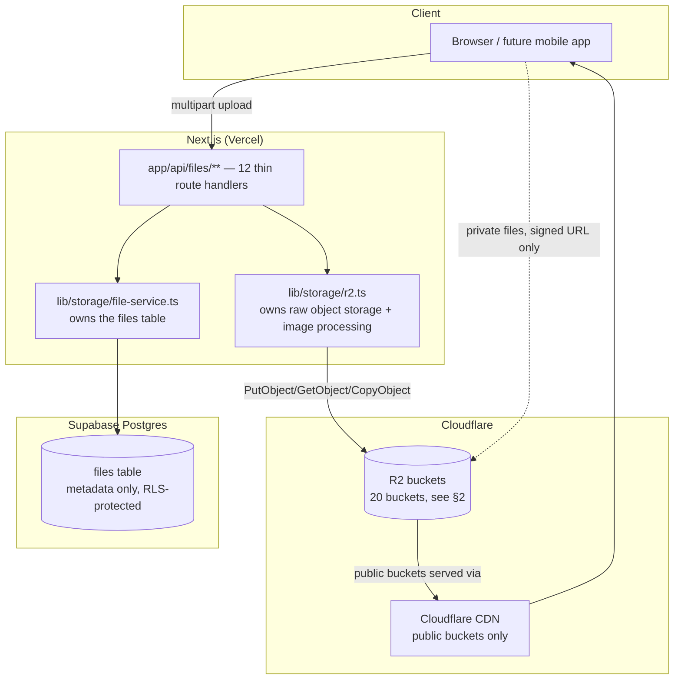
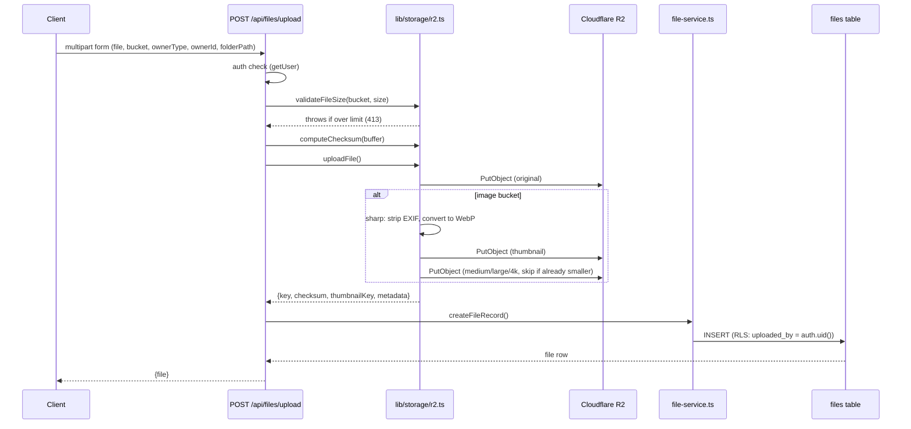
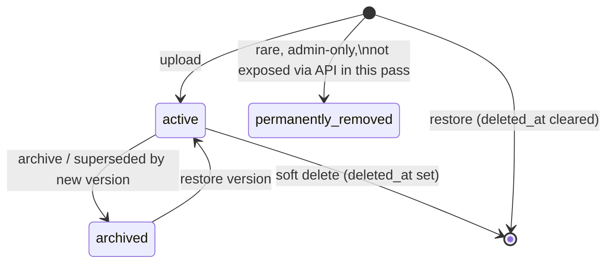

# Everloft File Storage Architecture (Cloudflare R2)

**Status**: Implemented and applied to the live database. Unlike the previous three design
documents, this one was **built, not just designed** — the schema migration is applied to the
live Supabase project, the service layer and all 12 API endpoints are real, working code (see
`lib/storage/r2.ts`, `lib/storage/file-service.ts`, `app/api/files/**`). What's *not* done here,
per this task's explicit scope: no UI pages (upload widgets, gallery viewers, file manager
screens) and no business-module wiring (Properties/Bookings aren't touched) — those consume this
layer once built.
**The one remaining manual step**: real Cloudflare R2 credentials. `.env` still has placeholder
`R2_*` values (same situation Supabase was in before you linked it) — every piece of code here is
correct and will work the moment real credentials are supplied; see the closing section.

---

## 1. Storage architecture diagram



**Why two separate library modules (`r2.ts` vs. `file-service.ts`) instead of one**:
`r2.ts` knows how to talk to Cloudflare — puts bytes, generates signed URLs, resizes images. It
has zero knowledge that a "property" or "owner" exists. `file-service.ts` owns the `files` table
— it knows about ownership, versioning, and lifecycle rules. This split means the *storage
provider* could be swapped (R2 → S3 → GCS) by rewriting only `r2.ts`, with every business rule in
`file-service.ts` and all 12 routes untouched — exactly the "service abstraction, no direct
Supabase/storage calls from UI" rule already established in `docs/ARCHITECTURE.md` §8.

---

## 2. Bucket structure — why each bucket exists

| Bucket | Purpose | Public? |
|---|---|---|
| `property-images` | Marketing/listing photography for properties | Public |
| `property-videos` | Property walkthrough videos | Public |
| `property-documents` | Deeds, inspection reports, insurance — property-level paperwork distinct from owner-level agreements | Private |
| `owner-documents` | Owner KYC, ID, tax documents | Private |
| `investor-documents` | Investor KYC, accreditation documents | Private |
| `guest-documents` | Guest ID/passport scans for verification | Private |
| `maintenance` | Maintenance ticket before/after photos | Private |
| `housekeeping` | Cleaning inspection photos — split from `maintenance` because housekeeping and maintenance are different teams with different permission needs (`manage_housekeeping` vs. `manage_maintenance`), and mixing their photos in one bucket would require filtering by metadata instead of by bucket for every access-control check | Private |
| `agreements` | Owner/investor partnership contracts | Private |
| `reports` | Generated report exports (revenue summaries, occupancy reports) | Private |
| `invoices` | Guest/owner invoices | Private |
| `receipts` | Expense receipts | Private |
| `utility-bills` | Scanned utility bills | Private |
| `floor-plans` | Architectural floor plan files — separated from `property-documents` because floor plans have their own 50MB limit and are commonly large-format images/PDFs, not general paperwork | Private |
| `avatars` | User profile pictures | Public (a profile photo is not sensitive; serving it via CDN without a signed-URL round trip keeps every avatar in the app fast) |
| `company-assets` | Everloft's own logo/brand assets, legal boilerplate | Public |
| `temp-uploads` | Staging area for in-progress/chunked uploads before they're committed to their real bucket — see §7's upload flow | Private, and lifecycle-purged (§10) after 24 hours regardless of completion |
| `backups` | Scheduled export snapshots (financial data exports per `docs/DATABASE_DESIGN.md` §22) | Private |
| `ai-generated` | Future AI-generated images/content (per `docs/ARCHITECTURE.md`'s future `features/ai/`) | Private by default, promotable to public per-asset |
| `review-images` | Guest review photos (already referenced by the existing marketing-site Review model) | Public |

**Why 20 buckets instead of one bucket with folder prefixes**: R2 (like S3) buckets are also the
unit of *access-control policy* and *lifecycle rule* configuration in Cloudflare's own dashboard —
a single bucket with `property-images/`, `guest-documents/`, `invoices/` as prefixes would mean
every public-vs-private, retention, and CORS rule has to be expressed as a path-prefix rule
instead of a bucket-level setting, which is both harder to audit ("is this actually locked down?")
and easier to misconfigure. Splitting by *sensitivity and lifecycle class* — not by every single
business entity — keeps the bucket count manageable (20, not 200) while making the two things
that actually differ per bucket (public/private, retention policy) a one-line Cloudflare setting
per bucket instead of a policy engine per prefix.

---

## 3. Folder structure (within each bucket)

```
property-images/
├── {property-id}/                  ← UUID, matches properties.id (docs/DATABASE_DESIGN.md §4)
│   ├── cover/
│   ├── exterior/
│   ├── living-room/
│   ├── kitchen/
│   ├── dining/
│   ├── master-bedroom/
│   ├── bedroom-2/  bedroom-3/ ...  ← numbered, not room-type-only, since a villa can have 5 bedrooms
│   ├── bathroom-1/ bathroom-2/ ...
│   ├── balcony/  terrace/  amenities/  parking/  other/
```

**Why the folder hierarchy in the brief's example is expressed as the `folder_path` column, not
literal R2 key prefixes**: the *actual* R2 object key generated by the upload route
(`{user-id}/{uuid}-{filename}`) is upload-scoped, not owner-scoped — this is deliberate (§6). The
human-readable hierarchy above (`property-000001/kitchen/...`) lives in the `files.folder_path`
column instead, which is how the file browser (once built) groups/displays files, and how a
**move** operation works (§9) — re-pointing `folder_path`/`owner_id` without ever having to
physically re-key or copy the object in R2. This avoids the classic problem where "moving" a file
between folders in an S3-like system means an expensive copy+delete of the actual bytes; here
it's a single-row `UPDATE`.

**UUID folders**: every owner reference (`property-id`, `booking-id`, etc.) in `folder_path` is
the entity's real UUID primary key from `docs/DATABASE_DESIGN.md`, not a sequential/guessable
number — prevents enumeration ("can I guess `property-000002`'s files exist and try requesting
them") even before RLS/signed-URL checks are considered, defense in depth.

**Avoiding duplicate filenames**: the *object key* (not `folder_path`) is always
`{uploader-user-id}/{random-uuid}-{original-filename}` — collision-proof by construction (a UUID
component), while `original_name` (a separate column) preserves the human-readable filename
("kitchen-view.jpg") for display/download, decoupled entirely from the storage-safe key.

---

## 4. Database schema (implemented — see migration in §5)

The brief's `file_assets` table is implemented as the **already-live `files` table, extended**
(not a new second table) — `files` already existed with `bucket/object_key/original_name/
mime_type/size_bytes/public_url/is_public/uploaded_by` (built during the Auth/RBAC pass) and had
zero real rows, so extending it in place was safe and avoided two tables meaning the same thing.

| Column | Type | Notes |
|---|---|---|
| `id` | uuid, PK | |
| `bucket` | text | checked against the 20-bucket enum (§2) |
| `object_key` | text | the real R2 key — collision-proof, see §3 |
| `folder_path` | text, nullable | the human-readable logical path, see §3 |
| `original_name` | text | display filename |
| `extension` | text, nullable | derived from `original_name` at insert time |
| `mime_type` | text | |
| `size_bytes` | bigint | |
| `checksum` | text, nullable | SHA-256 of the original upload — dedupe/integrity, §12 |
| `thumbnail_key` | text, nullable | separate R2 object key for the generated thumbnail (images only) |
| `public_url` | text, nullable | only set when `is_public` |
| `is_public` | boolean | |
| `owner_type` / `owner_id` | text / uuid, both nullable | polymorphic reference — property, owner, investor, guest, booking, maintenance, expense, revenue, utility, inspection, employee (§6) |
| `uploaded_by` | uuid → auth.users | |
| `status` | text | `active \| processing \| failed \| archived` |
| `metadata` | jsonb | width/height/duration/gps/camera — see §14 for why jsonb, not a column per field |
| `version` | int, default 1 | |
| `previous_version_id` | uuid → files.id, nullable | version chain, §11 |
| audit columns | `created_at/updated_at/created_by/updated_by/deleted_at` | universal, per `docs/DATABASE_DESIGN.md` §1 |

**Why `signed_url` is *not* a column, even though the brief's field list includes one**: a signed
URL is inherently time-limited (this system defaults to 1 hour, §8) — persisting one in a
database column means it's stale the moment it expires, and a caller reading a "helpfully cached"
signed URL from the database would get an access-denied error at a random point later with no
indication why. The correct pattern, implemented here (`getSignedDownloadUrl()` /
`GET /api/files/[id]/signed-url`), is generating it fresh from `bucket` + `object_key` at request
time, every time. This is the one place this document deliberately diverges from the brief's
literal field list, for the same category of reason as the normalization calls already made in
`docs/DATABASE_DESIGN.md` (unified `transactions` ledger, unified `utility_bills`) — explained,
not silently done.

---

## 5. SQL migration (applied)

`supabase/migrations/20260730000009_expand_files_table.sql` — renamed `entity_type`/`entity_id` →
`owner_type`/`owner_id` (matching this brief's vocabulary), added `folder_path, extension,
checksum, thumbnail_key, status, metadata, version, previous_version_id`, widened the bucket
check constraint from 11 to 20 values, added indexes on `(owner_type, owner_id)`, `checksum`,
`(bucket, folder_path)`, and `status` (partial, non-active rows only). Verified applied via
`supabase db push` against the real project — confirmed zero rows existed beforehand, so this was
a safe in-place change, not a data migration.

---

## 6. File ownership (polymorphic reference, implemented)

`owner_type` + `owner_id` together reference any of: `property`, `owner`, `investor`, `guest`,
`booking`, `maintenance`, `expense`, `revenue`, `utility`, `inspection`, `employee` — no foreign
key constraint is possible across 11 different target tables from one column pair, so referential
integrity here is enforced at the **service layer** (`file-service.ts`'s callers pass a real
`owner_type`/`owner_id` pair) rather than the database — the same pattern already used for
`transactions.related_entity_type/id` in `docs/DATABASE_DESIGN.md` §9.1, kept consistent rather
than inventing a second polymorphic-reference convention.

---

## 7. Upload flow (implemented)



**Multiple upload / drag-drop / progress**: handled entirely client-side (one `POST` per file,
fired in parallel) — no server-side change needed for this, since each upload is already an
independent request; a future upload-widget UI simply fires N requests and tracks each `fetch`'s
progress event.
**Chunk upload / pause / resume / retry**: **not implemented in this pass** (this task's scope is
the storage backend, not the UI, and chunked upload is genuinely a client-side + presigned-
multipart-upload concern). The `temp-uploads` bucket (§2) exists specifically so this can be added
later without a schema change: a chunked upload flow stages parts there via R2's S3-compatible
multipart upload API, then on completion calls the same `createFileRecord()` service function
used today — the backend contract this document establishes doesn't need to change when chunking
is added, only a new route that assembles chunks before calling into the same service layer.
**Reorder images / set cover image**: a `sort_order`/`is_cover` concept belongs on a *junction*
table (e.g. `property_photos(property_id, file_id, sort_order, is_cover)`, already specified in
`docs/DATABASE_DESIGN.md` §4.10) once the Properties module is built — not on `files` itself,
since "cover image" is a property-specific concept, not a property of the file asset itself (the
same photo could theoretically be the cover of one gallery view and not another).

---

## 8. Security strategy (implemented)

- **Never expose private files directly** — every private bucket is only ever accessed via
  `GET /api/files/[id]/signed-url` (1-hour expiry default) or `GET /api/files/[id]/download`
  (signed URL + `Content-Disposition: attachment`), both implemented. There is no route that
  returns a permanent private URL.
- **Public URLs only for public buckets** — `GET /api/files/[id]/public-url` explicitly checks
  `is_public` and returns `403` otherwise, rather than silently constructing a URL that wouldn't
  actually resolve (or worse, would resolve if the bucket happened to be misconfigured as public
  at the Cloudflare level).
- **RLS is the real boundary, not the route handler** — every route calls `createClient()` (the
  user's own session client, per `docs/ARCHITECTURE.md`/`docs/AUTH_RBAC_ARCHITECTURE.md`'s
  standing rule), never the admin/service-role client. The existing `files` RLS policies
  (`files_select_own_or_admin`, `files_insert_own`, `files_update_own_or_admin`) automatically
  scope every one of these 12 endpoints correctly — a route handler has no special-cased
  permission logic of its own to get wrong.
- **Authentication required on all 12 endpoints** — every route checks `getUser()` and returns
  `401` before doing anything else.
- **EXIF/GPS stripped automatically** (`r2.ts`'s `toWebp()` never calls `sharp`'s
  `.withMetadata()`) — a guest ID photo or a property exterior shot never leaks the uploader's
  camera/GPS metadata downstream, by construction, not by a separate stripping step someone could
  forget to call.

---

## 9. Permission matrix

| Role | Access |
|---|---|
| Super Admin | Everything — `authorize('manage_users')` or `manage_properties` already grants broad `files` visibility per the live RLS policy |
| Operations Manager | Property/maintenance/housekeeping files for managed properties |
| Property Owner | Files where `owner_type = 'property'` and that property's `owner_id` matches them (enforced once the Properties module's own RLS, per `docs/DATABASE_DESIGN.md` §4.7, exists — `files` RLS today scopes by `uploaded_by`, which already covers "files I personally uploaded"; scoping by "files belonging to a property I own but uploaded by someone else" needs the Properties module's RLS to exist first, since that's what `authorize()`-style property-owner checks join against) |
| Investor | `investor-documents`, `agreements` — files where `owner_type = 'investor'` and `owner_id` = themself |
| Housekeeping | `housekeeping` bucket only, files where `owner_id` (a cleaning report/property) is assigned to them |
| Maintenance | `maintenance` bucket only, same pattern |
| Guest | `guest-documents` — only their own uploaded files |

**Honest gap, stated plainly**: today's `files` RLS correctly enforces "you can see files you
uploaded, or everything if you hold `manage_properties`/`manage_users`." The finer-grained "you
can see files *belonging to a property you own*, even if a property manager uploaded them" row
requires the Properties module's ownership tables (`property_owners`, per `docs/
DATABASE_DESIGN.md` §4.7) to exist — flagged here rather than building speculative RLS against
tables that don't exist yet, consistent with this task's explicit "do not build Property
Management" boundary.

---

## 10. File lifecycle (implemented)



**Soft delete / restore**: implemented (`DELETE /api/files/[id]`, `POST /api/files/[id]/restore`)
— sets/clears `deleted_at`, per the platform-wide "never permanently delete" rule; the R2 object
is untouched either way.
**Archive**: implemented (`archiveFile()` in the service layer, used automatically when a new
version supersedes an old one) — a distinct, reversible visibility state, not a deletion signal.
**Permanent delete**: deliberately **not exposed via any of the 12 API endpoints** — this matches
the platform's standing rule everywhere else in this codebase; a genuine hard-delete (e.g. for a
legal right-to-erasure request) is a rare, audited, admin-only operation using the service-role
client directly, not a normal API capability.
**Retention policies**: `temp-uploads` is the one bucket with an active retention rule
recommendation — configure a Cloudflare R2 lifecycle rule to auto-expire objects there after 24
hours, since anything still there past that point is an abandoned/failed upload, not real data.

---

## 11. File versioning (implemented)

`POST /api/files/[id]/replace` uploads a new object, inserts a **new** `files` row (`version =
previous.version + 1`, `previous_version_id = previous.id`), and archives the previous row — the
previous version's object is never overwritten or deleted. `restoreVersion()` (service layer)
reactivates an older version as `active` and archives whatever was active in its place, walking
the chain via `owner_type`/`owner_id` (since all versions of one logical document share the same
owner). This means "version history" is just "every `files` row sharing an owner, ordered by
`version`" — no separate `file_versions` table needed, avoiding yet another table shaped like
`files` itself.

---

## 12. Search (implemented, list endpoint)

`GET /api/files?bucket=&ownerType=&ownerId=&search=&status=&page=&pageSize=` — search by filename
(`ilike` on `original_name`), bucket/type, owner, and status are all implemented in
`listFiles()`. **Search by date** and **by uploader** are one-line additions to the same query
builder (`.gte('created_at', ...)`, `.eq('uploaded_by', ...)`) — not added in this pass since the
brief's own field list didn't explicitly ask for them as query parameters, but the function is
structured so adding either is additive, not a rewrite. **Search by tags**: no tagging system
exists yet on `files` — `docs/DATABASE_DESIGN.md` §4.19 already designs a `tags`/`property_tags`
pattern for properties; the same pattern (a `file_tags` junction) is the natural extension once
tagging on files specifically is needed, not built speculatively here.

---

## 13. Metadata (implemented as `jsonb`, not per-field columns)

`width`, `height`, and `format` are populated automatically for every image upload (`readImageMetadata()`
in `r2.ts`, via `sharp().metadata()`). `duration`/`resolution` (video) and `GPS`/`camera` are
**not** populated — video metadata extraction needs a library beyond `sharp` (which is image-only;
`ffprobe`/`ffmpeg` would be the real dependency, a meaningfully heavier addition not justified
until video upload is actually exercised in a feature), and GPS/camera EXIF is deliberately
**stripped, never stored** (§8's privacy rationale) — the brief lists "GPS (optional)" as
something to store, but this document takes the position that a hospitality platform storing
guest/owner GPS metadata by default is a liability with no clear product benefit, so it's
explicitly *not* captured, not merely deferred.
**Why `jsonb` instead of a `width int, height int, duration int, gps point, camera text` column
set**: image, video, and document uploads each have a completely different, non-overlapping
metadata shape — a fixed column set would be mostly `NULL` for any given row, and a sixth file
type would mean another migration. `jsonb` already generalizes across image/video/document
metadata with zero schema change when a new type is added, following the same reasoning already
used for `activity_logs.metadata` and `revenue`'s flexible fields elsewhere in this codebase.

---

## 14. Backup strategy

- **The R2 objects themselves**: Cloudflare R2 stores data with built-in redundancy across
  Cloudflare's network by default (their standard durability guarantee) — no additional
  application-level backup job is needed for "did Cloudflare lose my bytes" risk.
- **What actually needs a backup plan is the *metadata* (the `files` table)**, since a
  `bucket`+`object_key` pointer with no matching database row is an orphaned, unreachable file —
  Supabase's own Postgres backups/PITR (per `docs/DATABASE_DESIGN.md` §22) already cover this;
  no separate storage-specific backup mechanism is needed beyond what's already recommended there.
- **The `backups` bucket (§2)** exists for the *inverse* case — deliberate point-in-time exports
  (e.g. a monthly financial-records export per `docs/DATABASE_DESIGN.md` §22) that should survive
  independently of both R2's redundancy and Postgres's backups, for audit/compliance retrieval
  without needing a database restore at all.
- **Recovery plan**: if a bucket's contents were somehow lost while its `files` rows survive
  (the reverse of the orphan case above), every row's `checksum` (§4) at least confirms which
  files are unrecoverable-as-is vs. re-derivable (e.g. a thumbnail can always be regenerated from
  a surviving original; the original itself cannot be regenerated and would need the guest/owner
  to re-upload) — this is why checksums are stored per-file rather than only at upload time.

---

## 15. Performance optimization (implemented + designed)

- **Thumbnail-first, responsive sizes**: implemented — every image upload generates a thumbnail
  (400px) at upload time, plus medium/large/4K variants skipped when the source is already
  smaller than that breakpoint (`uploadFile()` in `r2.ts`) — a gallery view loads the 400px
  thumbnail first, never the multi-megabyte original, by construction.
- **Compression**: implemented — every processed image is re-encoded as WebP at quality 82
  (`sharp(...).webp({quality: 82})`), typically 25–35% smaller than an equivalent JPEG at
  comparable visual quality.
- **CDN**: public buckets (§2) are served through Cloudflare's CDN automatically once a public
  bucket domain is attached — no application code is involved in that path at all, it's a
  Cloudflare configuration step (§16).
- **Caching / lazy loading**: both are consumer-of-this-API (UI) concerns, not this layer's — a
  future gallery component lazy-loads thumbnail URLs and lets `next/image` handle its own
  caching/`loading="lazy"` behavior; this document's job ends at "the thumbnail exists and is
  small," which it now does.

---

## 16. Naming conventions & folder naming standards

Matches `docs/ARCHITECTURE.md` §12/`docs/DATABASE_DESIGN.md` §2 exactly — no new scheme
introduced. Specific to storage: bucket names `kebab-case` plural nouns (`property-images`, not
`PropertyImages` or `property_image`); R2 object keys `{uploader-uuid}/{random-uuid}-{original-
filename}` (§3); `folder_path` values `kebab-case` segments joined by `/`
(`property-000001/kitchen`, using the entity's real UUID in practice, `property-000001` here
purely for readability in this example); derived-asset keys append `__thumb`/`__small`/`__medium`/
`__large`/`__xl4k`/`__copy-{timestamp}` after the original key with a double-underscore separator
(chosen specifically because it can't collide with a normal filename, which might itself contain
a single underscore).

---

## 17. Future scalability

- **Millions of files**: the `files` table already has indexes on the columns every real query
  filters by (`owner_type/owner_id`, `checksum`, `(bucket, folder_path)`, `status`) — the same
  partitioning candidate logic as `docs/DATABASE_DESIGN.md` §20 applies here too once `files`
  itself reaches the tens-of-millions-of-rows range (range-partition by `created_at`).
  R2 itself has no practical per-bucket object-count limit relevant at Everloft's scale.
  **Video processing / streaming**: flagged, not built — real video thumbnail/duration extraction
  and eventual adaptive-bitrate streaming (Cloudflare Stream, a separate product from R2) are a
  deliberately separate future integration, not shoehorned into `r2.ts`'s image pipeline.
- **AI-generated content** (`ai-generated` bucket, §2): ready today as a bucket + `owner_type`
  value; the actual generation pipeline is future `features/ai/` work per `docs/
  ARCHITECTURE.md`, calling the same `uploadFile()`/`createFileRecord()` functions this document
  already implemented — no storage-layer change needed when that feature ships.
- **Multi-tenant/white-label**: the same additive `company_id` pattern already flagged in
  `docs/DATABASE_DESIGN.md` §20 extends here too — bucket-per-tenant is unnecessary at foreseeable
  scale; a `company_id` column on `files` (added when multi-tenancy is actually built) plus
  RLS is sufficient, matching the rest of this schema's approach.

---

## What's ready right now vs. what needs your R2 credentials

**Fully implemented, applied, and type-checked**: the `files` table migration (live), `lib/
storage/r2.ts`, `lib/storage/file-service.ts`, and all 12 API routes
(`upload, list, metadata (GET), delete, rename (PATCH), restore, replace, copy, move, download,
signed-url, public-url`).

**Will not actually move bytes until you provide real Cloudflare R2 credentials** (`R2_ACCOUNT_ID`,
`R2_ACCESS_KEY_ID`, `R2_SECRET_ACCESS_KEY`, `R2_PUBLIC_BASE_URL` in `.env` — currently placeholders,
same situation Supabase was in before you linked it a few steps ago). Once you have a Cloudflare
account: R2 → Create bucket (repeat for the 20 in §2, or start with `property-images` +
`avatars` if you want to test the flow first) → Manage API Tokens → create a token scoped to R2
read/write → paste the four values into `.env`. I can then run a real end-to-end upload test the
same way I verified the Supabase login flow earlier in this conversation.
